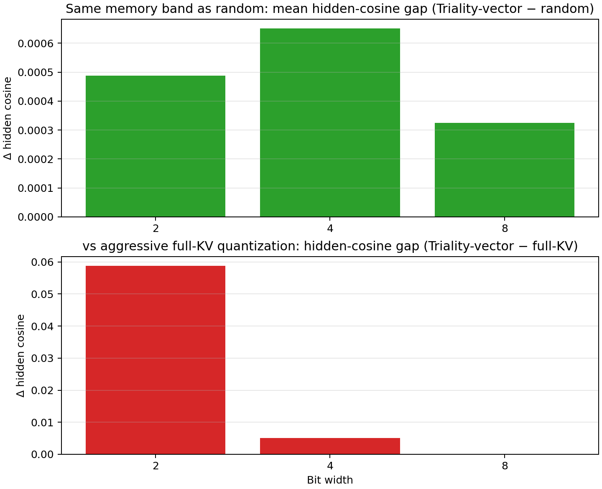

# TurboQuant CUDA — Paper-Faithful TurboQuant + Triality-Proxy SO(8) Research

Paper-faithful PyTorch implementation of the TurboQuant KV-cache compression algorithm,
Qwen3.5-9B captured KV replay, and K/V research extensions including triality-proxy SO(8) learned rotations.
**Windows + `uv` + Python 3.12.x**; CUDA via `uv sync --extra cu128`.

- **Current mainline**: RTX 3060 desktop 12 GB, Qwen3.5-9B text-only captured KV, and the fixed 7-mode comparison matrix driven by `scripts\validate_qwen_3060_matrix.py`.

- **What**: Reproduces TurboQuant Stage 1 (sphere Lloyd-Max) + Stage 2 (inner-product estimator + QJL sketch) faithful to the paper, then layers research extensions on top.
- **Integration project**: This repository, [zapabob/llama.cpp](https://github.com/zapabob/llama.cpp), and [zapabob/Hypura](https://github.com/zapabob/Hypura) are being developed together as a TurboQuant quantization integration project spanning offline artifact generation, GGUF/runtime consumption, and deployment-time serving.
- **Production K path**: Multiscreen relevance → per-channel mixed-bit allocation → triality-proxy SO(8) (vector proxy view) + TurboQuant Stage 1+2 on captured KV.
- **Validation order**: synthetic → attention → captured (lock offline correctness first).

## Scope Layers

- **Paper-faithful**: TurboQuant Stage 1 / Stage 2 math, paper mixed-bit presets, synthetic + captured attention replay.
- **Production canonical**: `key_only_block_so8_triality_vector`, which is the current **triality-proxy** vector-view K-only path. The runtime mode name is legacy; the math label is proxy, not true Spin(8) triality.
- **Research / ablation**: random/static SO(8), learned block-SO(8), proxy view comparisons, value-codec experiments, and future true `triality_spin8` work.

---

## Triality-Proxy SO(8): Current Research Differentiator

The distinguishing current research contribution of this repo is **per-layer learned SO(8) block rotations** applied to the K side before TurboQuant quantization via a triality-proxy view family.

### What it is

- The key head dimension is split into **8-dimensional blocks**.
- Each block is rotated by an element of **SO(8)** fit to minimize reconstruction loss on captured KV via gradient descent through the matrix exponential of a skew-symmetric generator (`block_so8_from_skew`).
- **Triality proxy** (`triality_proxy.py`) provides 3 empirical proxy views of the learned rotation: `vector`, `spinor_plus_proxy`, `spinor_minus_proxy`.
- These proxy views are **not** strict Spin(8) vector / half-spinor representations. True `triality_spin8` work is future research mode and is not the production default yet.
- The production canonical K path uses the **`vector` proxy view** with mode `key_only_block_so8_triality_vector` (see `k_triality.PRODUCTION_K_TURBOQUANT_MODE` / `PRODUCTION_K_TURBOQUANT_VIEW`).
- Trained rotations are saved to `rotations/*.pt` and loaded with `--rotation-dir`.

### Why it matters

At the same K-only memory budget as `key_only_random`:
- Triality-vector hidden cosine tracks or exceeds random at 2-bit
- `full_kv` uses less memory but hidden cosine degrades sharply at low bits — a different Pareto point

*Table: mean hidden cosine by K mode at selected bits (from `triality_summary_mean_pm_sd.md`)*

| Bits | `triality_vector` | `key_only_random` | `full_kv` | Δ (Tri − rand) | Δ (Tri − full-KV) |
| ---: | ---: | ---: | ---: | ---: | ---: |
| 2 | 1.000326 ± 0.004596 | 0.999837 ± 0.003729 | 0.941569 ± 0.004383 | +0.000488 | +0.058757 |
| 4 | 1.000651 ± 0.003762 | 1.000000 ± 0.003048 | 0.995605 ± 0.003115 | +0.000651 | +0.005046 |
| 8 | 0.999837 ± 0.003150 | 0.999512 ± 0.003321 | 0.999674 ± 0.003241 | +0.000326 | +0.000163 |

Ablation modes (`key_only_random`, static/learned SO(8), `full_kv`) remain available for reproducibility and paper replay.

---

## Architecture

| Layer | Role |
| --- | --- |
| `turboquant.paper_baseline` | Paper-faithful Stage 1 (sphere Lloyd-Max → `QuantizedMSEBatch`) + Stage 2 (QJL sketch residual correction → `QuantizedProdBatch`) |
| `turboquant.research_extension` | K/V codecs, V sensitivity, `ProtectedValueCodec`, Multiscreen KV relevance gate, **triality-proxy SO(8)**, production K modes |
| `turboquant.adapters.hf_qwen` | Optional: HF/Qwen KV capture from bf16/4bit/8bit weight loads |

### Rotation policies

| Policy | Description |
| --- | --- |
| `random_haar` | Dense Haar-like orthogonal matrix via QR decomposition (cached) |
| `block_so8_static` | Block-diagonal SO(8) with static seed-derived 8×8 blocks |
| `block_so8_learned` | Block-diagonal SO(8) fitted via gradient descent on quantization loss |
| `fast_hadamard` | D1·H·D2 structured rotation (O(d log d) via FWHT; materialised as dense matrix in `rotation_from_policy`). Use `apply_fast_rotation` for the O(d log d) path directly. |

---

## Related Repositories

| Repository | Role |
| --- | --- |
| [zapabob/multiscreen-pytorch](https://github.com/zapabob/multiscreen-pytorch) | PyTorch reference implementation of the Multiscreen architecture. `trim_and_square` + MiPE KV relevance scoring feeds into `research_extension` |
| [zapabob/Hypura](https://github.com/zapabob/Hypura) | GPU/RAM/NVMe tiered inference scheduler; combined with Multiscreen KV window cap for VRAM reduction |
| [zapabob/llama.cpp](https://github.com/zapabob/llama.cpp) | llama.cpp fork for consuming TurboQuant / triality-proxy artifacts on the GGUF side |

---

## Build Contract

This workspace is expected to stay aligned with two upstream sources of truth:

- **PyTorch / offline quantization semantics:** [zapabob/Turboquant-CUDA](https://github.com/zapabob/Turboquant-CUDA)
- **GGUF / runtime consumption path:** vendored [zapabob/llama.cpp](https://github.com/zapabob/llama.cpp) at `vendor/llama.cpp`

Rules:

- `.gitmodules` must keep `vendor/llama.cpp` pinned to `https://github.com/zapabob/llama.cpp.git`.
- Rust / Hypura builds must use the vendored `vendor/llama.cpp`, or `LLAMA_CPP_DIR` / `HYPURA_LLAMA_CPP_DIR` must point to a **zapabob/llama.cpp-compatible** checkout.
- A zapabob-compatible checkout is validated by the presence of the TurboQuant runtime files `src/llama-turboquant.h` and `src/llama-turboquant.cpp` plus the expected TurboQuant / triality symbols.
- Repo-level consistency is checked by `repo_contract.toml` and `scripts\validate_repo_contract.py`.

Validation:

```powershell
uv run python scripts\validate_repo_contract.py
```

This validation is also part of `.\scripts\run_production_tests.ps1`.

For Rust workspace builds, prefer:

```powershell
.\scripts\build_rust_workspace.ps1 -Package hypura -NoCuda
```

This runs the same contract validation before invoking `cargo build`.
If `rust\target` is pressuring disk space, add `-TargetDir "C:\path\to\cargo-target"` to move Cargo artifacts to a roomier drive.

---

## Contributing GPU Benchmarks

We are building a community result table. If you have hardware not yet represented, please run the scripts and open an issue.

**Target hardware:**
- NVIDIA RTX 3080 Ti / 3090 / 4090 / 4090 Ti / 5090 (CUDA)
- AMD RDNA4 (HIP / ROCm)
- Apple M-series (Metal / MPS)

**Requested metrics:**
- PPL (WikiText-103) at bits 2 / 2.5 / 3 / 3.5 / 4 for Stage 1 and Stage 1+2
- NIAH (Needle-in-a-Haystack) retrieval accuracy at each bit level
- Decode speed (tokens/sec) vs `q8_0` and `q4_0` baselines
- VRAM footprint at each bit level (use `research_vram_multigroup_qwen.py`)

**How to contribute:**
1. Fork [zapabob/Turboquant-CUDA](https://github.com/zapabob/Turboquant-CUDA)
2. Capture KV: `uv run python scripts\capture_qwen_kv.py --weight-load 4bit --dtype bfloat16 --trust-remote-code --model-id <your-model-path> --output-dir artifacts\kv_4bit --max-length 64`
3. Run `uv run python scripts\paper_validate_synthetic.py --trials 8`
4. Run `uv run python scripts\research_validate_multiscreen_kv.py --captured-dir artifacts\kv_4bit --eval-device cuda`
5. Run `uv run python scripts\research_vram_multigroup_qwen.py --kv-dir artifacts\kv_4bit --eval-device cuda --trials 8` for VRAM data
6. Open an issue titled **"GPU Benchmark: \<GPU model\>"** and attach the CSV outputs from `artifacts/`

---

## Environment Setup

**Required**: Run all commands from `hub_Qwen3.5-9B-SOT/` (the directory containing `pyproject.toml`).

```powershell
irm https://astral.sh/uv/install.ps1 | iex
uv python install 3.12.9
uv venv --python 3.12.9
uv sync --extra cu128 --extra dev --extra hf_qwen --extra eval
uv run python scripts\env_check.py
```

- `--extra cu128`: required for CUDA PyTorch (omitting gives CPU-only torch)
- `--extra hf_qwen`: required for `capture_qwen_kv.py` (transformers, accelerate, bitsandbytes)
- `--extra eval`: required for the new HF/runtime online evaluation scripts (`datasets`, `lm-eval`, `openai` client, HF runtime deps)
- Do **not** use bare `py -3` for project scripts — use `uv run python ...`
- From a parent directory: `uv run --project hub_Qwen3.5-9B-SOT python scripts\...`

Production bundle (env check + pytest):

```powershell
.\scripts\run_production_tests.ps1
```

---

## Quick Start (12GB Mainline)

```powershell
Set-Location H:\path\to\hub_Qwen3.5-9B-SOT
uv run python scripts\env_check.py
uv run python -m pytest tests\test_reporting.py tests\test_repo_contract.py tests\test_qwen_3060_matrix.py tests\test_attention_metrics.py tests\test_turboquant_prod.py -q
uv run python scripts\validate_repo_contract.py
```

---

## TurboQuant Studio (Local Workbench)

`TurboQuant Studio` is the local single-user operator shell for this repo:

- **backend**: FastAPI job orchestration over the existing capture / validate / runtime / export / serve flows
- **frontend**: React + Vite SPA with tabs for `Setup`, `Capture`, `Offline Validate`, `Compare`, `Runtime Eval`, `Package & Export`, and `Serve`
- **artifact contract**: result files stay in the existing `artifacts\...` roots; Studio only indexes and orchestrates them

Research rules remain visible in the UI:

- offline-first
- Stage 1 / Stage 2 kept distinct
- exact / exact-score / estimated-score kept distinct
- reconstruction metrics separated from attention / logit metrics
- reproducibility metadata attached to every run record

### Backend startup

```powershell
uv run python scripts\run_turboquant_studio.py
```

This serves the FastAPI API at `http://127.0.0.1:8000` and, after a frontend build, also serves the Studio UI.

### Frontend dev workflow

```powershell
Set-Location .\studio-web
npm install
npm run dev
```

The Vite dev server proxies `/api` and `/artifacts` back to the local FastAPI app.

### Frontend production build

```powershell
Set-Location .\studio-web
npm run build
```

After the build, open `http://127.0.0.1:8000/studio`.

### Validation-first workflow

Every Studio action follows the same operator pattern:

1. `Validate`
2. `Preview`
3. `Run`

Use dry-run previews first for capture, matrix validation, runtime evaluation, packaging, and serving changes.

---

## RTX 3060 12GB Matrix Flow

### 1. Qwen KV Capture

- The 12 GB mainline capture root is `artifacts\kv_rtx3060_qwen9b`.
- Reuse that artifact root if it already contains normalized capture manifests.
- The recommended capture preset is `qwen35_9b_12gb`.

```powershell
uv run python scripts\capture_qwen_kv.py `
  --model-preset qwen35_9b_12gb `
  --weight-load 4bit --dtype bfloat16 --trust-remote-code `
  --model-id "H:\Qwen3.5-9B-official-hf" `
  --output-dir artifacts\kv_rtx3060_qwen9b --max-length 64
```

Outputs: `artifacts\<kv-dir>\<capture_id>\capture_manifest.json` and per-layer `layer_*_{key,value}.pt`.

### 2. Optional paper baseline reference

```powershell
uv run python scripts\paper_validate_captured_qwen.py --kv-dir artifacts\kv_rtx3060_qwen9b
```

### 3. Run the reduced real 12 GB matrix

This is the current mainline comparison:
- `exact`
- `key_only_random`
- `full_kv`
- `asym_q8_turbo4`
- `asym_q8_turbo3`
- `multiscreen_relevance`
- `key_only_block_so8_triality_vector`

```powershell
uv run python scripts\validate_qwen_3060_matrix.py `
  --kv-dir artifacts\kv_rtx3060_qwen9b `
  --rotation-dir artifacts\research_extension\triality_full_train_prod_bf16\rotations `
  --eval-device cuda `
  --bits 3,3.5,4 `
  --trials 3 `
  --max-layers 2 `
  --skip-plots `
  --output-dir artifacts\qwen_3060_matrix
```

Primary outputs:
- `artifacts\qwen_3060_matrix\metrics\qwen_3060_matrix_trials.csv`
- `artifacts\qwen_3060_matrix\metrics\qwen_3060_matrix_summary.csv`
- `artifacts\qwen_3060_matrix\metrics\qwen_3060_matrix_mean_pm_sd.csv`
- `artifacts\qwen_3060_matrix\qwen_3060_matrix_report.md`

### 3b. Observed reduced real outcome
- Source files:
  - `artifacts\qwen_3060_matrix\metrics\qwen_3060_matrix_mean_pm_sd.csv`
  - `artifacts\qwen_3060_matrix\metrics\qwen_3060_matrix_summary.csv`
  - `artifacts\qwen_3060_matrix\reports\qwen_3060_matrix_summary.md`
- Evaluation shape:
  - raw trial rows: `4 prompt captures x 2 layers x 3 trials = 24` rows per mode/bit in `qwen_3060_matrix_trials.csv`
  - pairwise Wilcoxon-Holm tables therefore report `n_pairs = 24`
  - per-prompt summary rows in `qwen_3060_matrix_summary.csv` report `n = 6` with `std`, `sem`, and `ci95_*`
- Plot convention:
  - the figures below are tracked README copies of the exported matrix plots
  - points are means, and the plotted error bars come from `sem` in `qwen_3060_matrix_summary.csv`

**Quality summary with error bars**


**Runtime / VRAM summary with error bars**


**4-bit headline mean +/- SD (from `qwen_3060_matrix_mean_pm_sd.csv`)**

| Mode | Logit cosine | Hidden cosine | Memory ratio vs exact |
| --- | --- | --- | --- |
| `exact` | `1.000000 +/- 0.000000` | `1.000000 +/- 0.000000` | `1.000000 +/- 0.000000` |
| `key_only_random` | `0.997396 +/- 0.006379` | `1.002604 +/- 0.004034` | `0.628906 +/- 0.000000` |
| `full_kv` | `0.997396 +/- 0.006379` | `0.994792 +/- 0.003189` | `0.255859 +/- 0.000000` |
| `asym_q8_turbo4` | `1.001302 +/- 0.005881` | `0.994141 +/- 0.004784` | `0.378906 +/- 0.000000` |
| `asym_q8_turbo3` | `0.996745 +/- 0.002941` | `0.981771 +/- 0.004731` | `0.347656 +/- 0.000000` |
| `multiscreen_relevance` | `1.002604 +/- 0.006379` | `1.000000 +/- 0.000000` | `0.660156 +/- 0.000000` |
| `key_only_block_so8_triality_vector` | `1.000000 +/- 0.000000` | `0.999349 +/- 0.001595` | `0.628906 +/- 0.000000` |

**Selected 24-row summary statistics from `qwen_3060_matrix_trials.csv`**

| Mode / bit | `n` | Hidden cosine SEM | Hidden cosine 95% CI | Memory ratio vs exact |
| --- | ---: | ---: | --- | ---: |
| `multiscreen_relevance @ 4-bit` | `24` | `0.000879` | `[0.998995, 1.002632]` | `0.651139 +/- 0.009238` |
| `key_only_block_so8_triality_vector @ 4-bit` | `24` | `0.000900` | `[0.998788, 1.002514]` | `0.628906 +/- 0.000000` |
| `asym_q8_turbo4 @ 4-bit` | `24` | `0.003050` | `[0.982459, 0.995080]` | `0.378906 +/- 0.000000` |
| `full_kv @ 3-bit` | `24` | `0.000803` | `[0.980109, 0.983432]` | `0.193359 +/- 0.000000` |

**How to read the reduced real slice**

- `multiscreen_relevance` is the best logit-side 4-bit row in the exported `mean +/- SD` table: `1.002604 +/- 0.006379` logit cosine with `1.000000 +/- 0.000000` hidden cosine, at a higher memory ratio than the K-only rows.
- `key_only_block_so8_triality_vector` stays on the same K-only memory band as `key_only_random` at 4-bit (`0.628906`) while tightening hidden-state dispersion to `0.999349 +/- 0.001595`, which is the most stable hidden-side K-only row in this reduced slice.
- `asym_q8_turbo4` remains the aggressive memory-saving baseline worth watching: `0.378906` memory ratio, `1.001302 +/- 0.005881` logit cosine, but a clearly weaker hidden cosine at `0.994141 +/- 0.004784`.
- The reduced slice still shows `full_kv` as the memory floor, but the low-bit hidden-state penalty is material; at 3-bit the pairwise Wilcoxon-Holm table reports `delta = -0.018229` hidden cosine vs exact with `p_holm = 5.869920418014882e-05`.
- At 4-bit, `asym_q8_turbo4` is **not** significantly different from exact on logit cosine in the Wilcoxon-Holm table (`p_holm = 0.6859136620657271`), but **is** significantly lower on hidden cosine (`p_holm = 0.0002985592932016`).
- The reduced slice produces degenerate Friedman rows (`nan`, `p = 1.0`) because the pooled blocks are too tied / small for a useful omnibus test here; the pairwise Wilcoxon-Holm rows carry the interpretable signal.

### 4. Export the 12 GB matrix report bundle

```powershell
uv run python scripts\export_report.py --matrix-dir artifacts\qwen_3060_matrix
```

Exported report outputs land under:
- `artifacts\qwen_3060_matrix\plots\`
- `artifacts\qwen_3060_matrix\reports\qwen_3060_matrix_summary.md`
- README publication copies of the PNGs in this repo live under `_docs\assets\`

### 5. Verify the vendored runtime consumption path

```powershell
.\scripts\build_rust_workspace.ps1 -Package hypura -NoCuda
```

This command validates `repo_contract.toml` and then invokes the Rust workspace build against the vendored `vendor/llama.cpp`.

## Paper Claim Audit

The original paper and the later Google Research blog are strong evidence for **memory reduction** and **score-like / inner-product preservation**. They are not, by themselves, universal guarantees about every runtime's **value transport**, **hidden-state preservation**, or **downstream portability**.

- Primary sources:
  - Paper: [TurboQuant: Online Vector Quantization with Near-optimal Distortion Rate](https://arxiv.org/abs/2504.19874), first posted on **April 28, 2025**
  - Google Research blog: [TurboQuant: Redefining AI efficiency with extreme compression](https://research.google/blog/turboquant-redefining-ai-efficiency-with-extreme-compression/), published on **March 24, 2026**
- What the paper explicitly centers:
  - near-optimal MSE / inner-product distortion rates
  - unbiased residual correction with the 1-bit QJL stage
  - long-context benchmark results on the paper's tested model/runtime stack
- What this repo directly re-tests:
  - Qwen3.5-9B captured KV replay
  - hidden-state / attention-output transport under K-only vs full-KV style paths
  - whether score-neutral behavior is still portable once the V path is compressed in this runtime

**Audit table (`artifacts\paper_baseline\google_blog_audit\metrics\google_blog_paper_qwen_audit.md`)**

| Claim family | Original-source status | Qwen3.5-9B replay status in this repo | README stance |
| --- | --- | --- | --- |
| KV memory reduction is large | Directly supported by paper/blog | Directly reproduced | Supported |
| Dot-product / score-like quality is strong | Directly supported by paper/blog | Directly reproduced on logit-like metrics | Supported |
| Hidden-state / value transport remains neutral | Not a theorem in the paper | `full_kv` degrades hidden cosine and attention-output error before K-only | Not supported as a blanket claim |
| Downstream neutrality is runtime-agnostic | Blog-level summary, not a theorem | Qwen replay says portability is conditional | Treat as model/runtime-specific, not universal |

**Concrete audit outcome from local evidence**

- `google_blog_audit` and the captured paper-baseline replay agree that **memory claims are real**.
- They also agree that **score-like metrics can look nearly neutral while value transport is already failing**.
- In this repo, that failure shows up as a widening gap between `key_only_random` and `full_kv` on `hidden_cosine_similarity` and `attention_output_relative_error`, even when logit-side metrics remain close.

## Cherry-picking Risk

The biggest reading error around TurboQuant is to look only at **logit cosine / next-logit KL / benchmark headline scores** and skip the **hidden / transport** side.

- If we only read the paper/blog as "TurboQuant is lossless at low bits everywhere", we overgeneralize a score-centric result into a transport/runtime result.
- If we only read this repo as "full_kv saves the most memory, so it is the practical winner", we ignore the fact that the V path is exactly where hidden-state drift shows up first.
- The right interpretation is a Pareto one:
  - K-only paths often keep transport healthier at higher memory cost.
  - `full_kv` and asymmetric V-first rows can be attractive memory points, but they must be judged with hidden/error metrics and task benchmarks, not logit summaries alone.

## Pareto Frontiers

This repo already has three different Pareto views that should be read together:

1. **Replay memory vs logit/hidden quality**
   - `_docs/assets/qwen_3060_matrix_attention.png`
   - `artifacts\paper_baseline\qwen_captured_reported\plots\attention_tradeoffs_captured.png`
2. **Triality hidden-quality Pareto**
   - `artifacts\research_extension\triality_full_eval_prod_bf16\plots\triality_advantage_pareto_hidden_memory.png`
3. **Online-eval memory joins**
   - generated by `scripts\export_online_eval_report.py` once HF/runtime artifacts exist

The practical reading is:

- `multiscreen_relevance` and `key_only_block_so8_triality_vector` are the strongest 12 GB replay rows when hidden stability matters.
- `asym_q8_turbo4` is the aggressive memory-saving baseline worth keeping in the comparison, but it is not hidden-neutral here.
- The reduced 3060 slice still emits `Friedman` rows, but they are degenerate (`nan`, `p = 1.0`) and are **not** used as omnibus evidence in this README. The interpretable inferential signal is the pairwise `Wilcoxon-Holm` table.

## Online Benchmarks

This repo now has two separate online-eval roles, and they should not be collapsed into one claim bucket:

- **HF online adapter**
  - `scripts\eval_hf_online_qwen.py`
  - `turboquant.adapters.hf_qwen.online_eval`
  - purpose: diagnose TurboQuant math / cache-path drift on Qwen before blaming the runtime
- **current-main runtime audit**
  - `scripts\prepare_online_eval_inputs.py`
  - `scripts\eval_runtime_qwen.py`
  - `scripts\audit_zapabob_runtime.py`
  - `turboquant.runtime_eval`
  - purpose: measure what the authoritative external `zapabob/llama.cpp` `main` can actually claim today
- **aggregation / export**
  - `scripts\export_online_eval_report.py`

### llama.cpp Runtime Evidence

The authoritative runtime for this phase is **external** `C:\Users\downl\Desktop\llama.cpp-zapabob` on current `main`, not the replay-only PyTorch path in this repo.

The reduced current-main audit is closed in:

- `_docs/2026-04-17_current-main-zapabob-runtime-audit_hub_Qwen3.5-9B-SOT.md`

What completed in that audit:

- `llama-perplexity`
- `llama-bench`
- `llama-server + lm-eval` chat path on `gsm8k`
- `LLAMA_TURBOQUANT=1` smoke with SO8 / triality env knobs enabled
- fresh `Q8_0 -> .turboquant.gguf` repack + manifest / bridge readback as secondary validation

What current-main **does not** prove yet:

- the audited source accepts `LLAMA_TURBOQUANT*` env knobs, but the current-main code path does **not** yet expose a claimable mode-selectable SO8 / triality runtime compute branch
- stock current-main `llama-server` does **not** expose prompt `token_logprobs` through `/v1/completions`, so `lm-eval` multiple-choice loglikelihood tasks are not claimable via the stock API surface
- because of that, this README does **not** claim runtime TurboQuant superiority or pairwise benchmark p-values from current-main today

### Standard Target Battery

- PPL corpus: `WikiText-2` (within-model, same-tokenizer relative comparison only)
- MCQ / task battery: `hellaswag`, `piqa`, `arc_easy`, `arc_challenge`, `mmlu`
- chat/generative task: `gsm8k`

### Statistical Policy

- continuous metrics (`perplexity`, `log_perplexity`, throughput): `n`, `mean`, `std`, `sem`, `95% CI`
- benchmark task scores: item-level accuracy with `95% CI`
- pairwise continuous comparisons: `Wilcoxon signed-rank + Holm`
- pairwise benchmark comparisons: `McNemar` on paired item outcomes
- if fewer than 2 claimable runtime modes exist, pairwise outputs stay explicitly unavailable instead of inventing p-values
- no mixed-task omnibus p-value is used for benchmark claims

### HF / Replay As Diagnostic Support

The HF online adapter remains useful, but its role is narrower than runtime proof:

- isolate Qwen cache/math drift from runtime implementation drift
- test the same mode family on a controlled, evaluation-only path
- prepare item-level / chunk-level schemas that later runtime artifacts can join

It is **diagnostic support**, not a substitute for `llama.cpp` runtime evidence.

## Secondary Research Flows

### Triality full pipeline (train + eval)

[`scripts/run_triality_full_pipeline.py`](scripts/run_triality_full_pipeline.py) always runs
`research_train_k_triality.py` then `research_validate_k_triality.py`.

```powershell
$env:PYTHONUNBUFFERED = "1"
uv run python scripts\run_triality_full_pipeline.py `
  --kv-dir artifacts\kv_rtx3060_qwen9b `
  --train-output-dir artifacts\research_extension\triality_full_train `
  --eval-output-dir artifacts\research_extension\triality_full_eval
```

Default `--bits`: `2,2.5,3,3.5,4,8` (8 is a repo extension; paper-only: `--bits 2,2.5,3,3.5,4`).
Everything after `--` is forwarded to the eval script:

```powershell
uv run python scripts\run_triality_full_pipeline.py --kv-dir artifacts\kv_rtx3060_qwen9b -- --resume
```

**Note**: training still runs every time above. To evaluate only from saved rotations, use:

```powershell
$env:PYTHONUNBUFFERED = "1"
uv run python scripts\research_validate_k_triality.py `
  --kv-dir artifacts\kv_rtx3060_qwen9b `
  --rotation-dir artifacts\research_extension\triality_full_train\rotations `
  --bits 2,2.5,3,3.5,4,8 `
  --eval-device cuda `
  --output-dir artifacts\research_extension\triality_full_eval `
  --resume
```

**Important**: Never run multiple evals/pipelines on the **same `--output-dir`** concurrently.

### Mixed-bit Multiscreen + Triality Proxy

```powershell
# Production K path (triality-proxy SO(8), vector proxy view, default --mode)
uv run python scripts\research_validate_multiscreen_kv.py `
  --captured-dir artifacts\kv_rtx3060_qwen9b --eval-device cuda

# Ablation: multiscreen relevance + explicit bits
uv run python scripts\research_validate_multiscreen_kv.py `
  --captured-dir artifacts\kv_rtx3060_qwen9b --mode multiscreen_relevance --bits 3 --max-layers 4
```

### VRAM / KV Footprint Multi-group Study

```powershell
uv run python scripts\research_vram_multigroup_qwen.py `
  --kv-dir artifacts\kv_rtx3060_qwen9b `
  --model-id "H:\Qwen3.5-9B-official-hf" `
  --eval-device cuda --trials 8

# With learned rotations and triality vector mode
uv run python scripts\research_vram_multigroup_qwen.py `
  --kv-dir artifacts\kv_rtx3060_qwen9b --eval-device cuda --trials 8 `
  --modes exact,multiscreen_relevance,multiscreen_triality_vector `
  --rotation-dir artifacts\research_extension\triality_full_train\rotations
```

---

## Eval Output Layout

### Primary 12GB matrix outputs

| Path | Contents |
| --- | --- |
| `artifacts/qwen_3060_matrix/metrics/qwen_3060_matrix_trials.csv` | Raw per-trial rows for the 7-mode 12 GB matrix |
| `artifacts/qwen_3060_matrix/metrics/qwen_3060_matrix_summary.csv` / `.md` | Pooled summary (mean, std, sem, CI) |
| `artifacts/qwen_3060_matrix/metrics/qwen_3060_matrix_mean_pm_sd.csv` / `.md` | Mode x bit mean +/- SD table |
| `artifacts/qwen_3060_matrix/metrics/qwen_3060_matrix_friedman.csv` / `.md` | Friedman test across the 7 modes |
| `artifacts/qwen_3060_matrix/metrics/qwen_3060_matrix_pairwise.csv` / `.md` | Pairwise Wilcoxon-Holm vs baseline modes |
| `artifacts/qwen_3060_matrix/reports/qwen_3060_matrix_summary.md` | Exported Markdown summary used by repo docs |
| `artifacts/qwen_3060_matrix/plots/qwen_3060_matrix_attention.png` | Attention/logit trade-off plot |
| `artifacts/qwen_3060_matrix/plots/qwen_3060_matrix_runtime.png` | Runtime trade-off plot |

### Secondary triality outputs

| Path | Contents |
| --- | --- |
| `metrics/triality_trials_captured.csv` | Raw per-trial rows |
| `metrics/triality_summary_captured.csv` / `.md` | Pooled summary (mean, std, sem, CI) |
| `metrics/triality_summary_mean_pm_sd.csv` / `.md` | Mode × bit mean ± SD table |
| `metrics/triality_statistics.csv` / `.md` | Mode-wise statistical tests |
| `metrics/triality_friedman_rotation_modes.csv` / `.md` | Friedman test across K modes at fixed bit |
| `metrics/triality_pairwise_wilcoxon_rotation_modes.csv` / `.md` | Pairwise Wilcoxon vs baseline (Holm) |
| `metrics/eval_resume_state.json` | Resume cursor + config fingerprint |
| `plots/triality_*_captured.png` | Trade-off / mean±SD plots |
| `plots/triality_advantage_*.png` | Triality advantage figures |
| `eval_status.json` | Stage machine (done → `finish`) |

Extra eval flags: `research_validate_k_triality.py -h` (`--skip-statistics`, `--skip-plots`, `--evaluate-only`, `--from-existing-trials`, `--force-fresh`).

---

## Paper Baseline Reference Results (Captured Qwen3.5-9B)

*Source: `artifacts/paper_baseline/qwen_captured_full_bf16/metrics/attention_trials_captured.csv`; n = 96 per (mode, bit) — 4 prompts × 8 layers × 3 trials.*

*KO = key_only_random, FV = full_kv. Mixed-bit: 2.5 = 25% @3bit + 75% @2bit; 3.5 = 25% @4bit + 75% @3bit.*

| Bits | Logit cosine | Hidden cosine (KO) | Hidden cosine (FV) | Memory/exact (KO) | Memory/exact (FV) | Attn err (KO) | Attn err (FV) |
| ---: | --- | --- | --- | ---: | ---: | --- | --- |
| 2 | 0.997314 ± 0.003554 | 0.999756 ± 0.003794 | 0.940959 ± 0.003962 | 0.566406 | 0.130859 | 0.027470 ± 0.021959 | 0.339172 ± 0.006291 |
| 2.5 | 0.998494 ± 0.003982 | 0.998779 ± 0.004099 | 0.958700 ± 0.003791 | 0.574219 | 0.146484 | 0.027599 ± 0.029244 | 0.285421 ± 0.006102 |
| 3 | 0.999349 ± 0.003872 | 0.999715 ± 0.003168 | 0.982625 ± 0.003395 | 0.597656 | 0.193359 | 0.014811 ± 0.013992 | 0.184458 ± 0.004565 |
| 3.5 | 0.999308 ± 0.003353 | 1.000285 ± 0.003896 | 0.988403 ± 0.003179 | 0.605469 | 0.208984 | 0.015692 ± 0.016130 | 0.151886 ± 0.004057 |
| 4 | 0.999552 ± 0.004312 | 0.999959 ± 0.003823 | 0.995524 ± 0.003352 | 0.628906 | 0.255859 | 0.006952 ± 0.005955 | 0.096430 ± 0.002715 |
| 8 | 1.000244 ± 0.004563 | 1.000000 ± 0.003802 | 0.999715 ± 0.003854 | 0.753906 | 0.505859 | 0.002421 ± 0.001509 | 0.029344 ± 0.000504 |

**Qualitative takeaway**: paper-faithful `full_kv` tends to break **hidden / transport metrics** (V-dependent) before logit-style scores vs `key_only_random`. KV savings are real; the K-only path is more stable at low bits.

Interactive plots:
- [attention_tradeoffs_captured.html](artifacts/paper_baseline/qwen_captured_full_bf16/plots/attention_tradeoffs_captured.html)
- [attention_runtime_tradeoffs_captured.html](artifacts/paper_baseline/qwen_captured_full_bf16/plots/attention_runtime_tradeoffs_captured.html)


---

## Triality Advantage Figures




Regenerate: `uv run python scripts\plot_triality_advantage.py` (use `--input-csv` / `--plots-dir` to override paths).

---

## Scripts Reference

| Category | Scripts |
| --- | --- |
| Paper baseline | `paper_validate_synthetic.py`, `paper_validate_attention.py`, `paper_validate_captured_qwen.py` |
| Triality train/eval | `research_train_k_triality.py`, `research_validate_k_triality.py`, `run_triality_full_pipeline.py`, `plot_triality_advantage.py` |
| Multiscreen + VRAM | `research_validate_multiscreen_kv.py`, `research_vram_multigroup_qwen.py` |
| V codecs | `research_validate_v_codecs.py`, `research_value_sensitivity.py` |
| HF / Qwen | `capture_qwen_kv.py`, `validate_attention_scores.py`, `eval_hf_online_qwen.py`, `export_report.py`, `export_online_eval_report.py` |
| Runtime / lm-eval | `prepare_online_eval_inputs.py`, `eval_runtime_qwen.py`, `audit_zapabob_runtime.py` |
| Environment | `env_check.py`, `benchmark_encode_decode.py` |

---

## Config Families

- `turboquant_config.paper.json` — paper baseline and HF replay (`PAPER_SCHEMA_KIND`)
- `turboquant_config.research.json` — research extensions (`RESEARCH_SCHEMA_KIND`)

Schema helpers: `turboquant.schema` — `build_*_config`, `read_turboquant_config`, `write_turboquant_config`, `validate_*_config`.

---

## License

Apache License 2.0 — [LICENSE](LICENSE)
