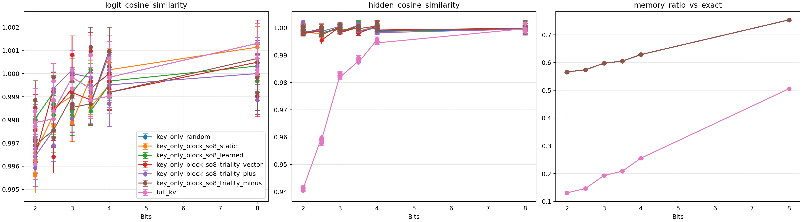
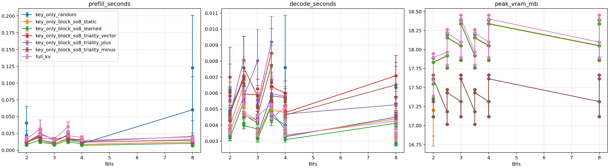
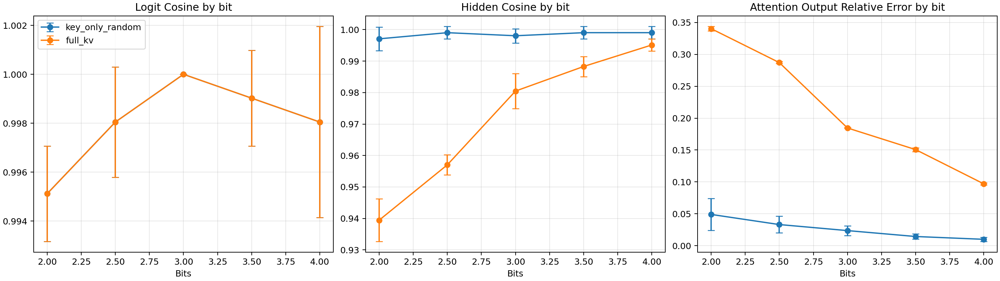
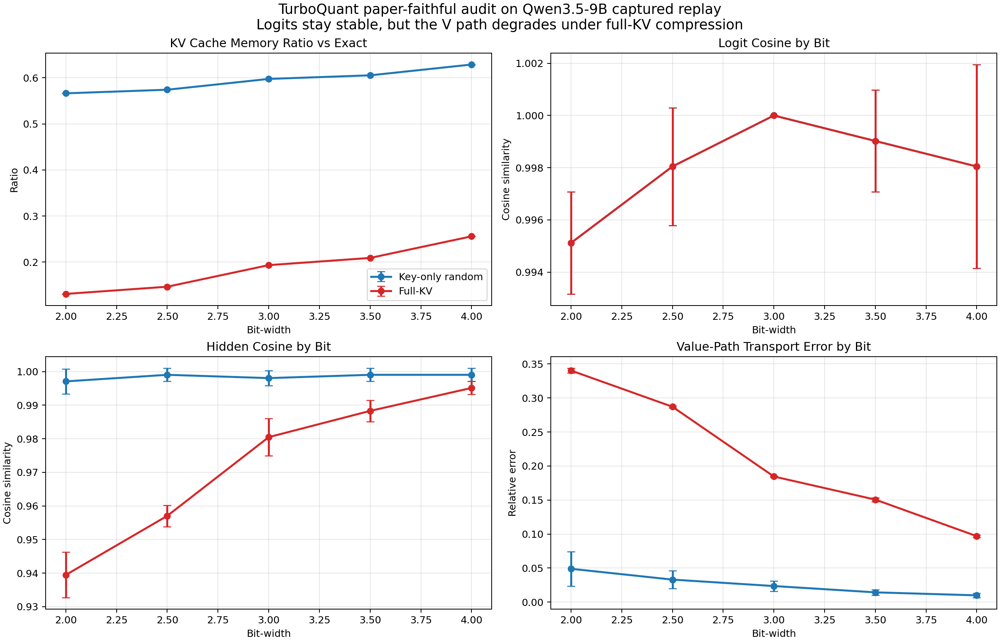

# TurboQuant CUDA（Qwen3.5-9B） / TurboQuant CUDA (Qwen3.5-9B)

## TL;DR / TL;DR

**JA**

- **何ものか**: TurboQuant の PyTorch 正系再現 + Qwen3.5-9B の **captured KV replay** + K/V 研究（Triality 等）。**Windows + `uv` + Python 3.12.x**；GPU は `uv sync --extra cu128`。
- **まず読む順**: 検証は **synthetic → attention → captured**。クイックスタートは `env_check` → `pytest` → `paper_validate_*`（本文のコマンドブロック）。
- **本番の流れ**: `capture_qwen_kv.py` → `paper_validate_captured_qwen.py` →（任意）`run_triality_full_pipeline.py` または学習済みなら `research_validate_k_triality.py`（**再開は `--resume`**、同一 `--output-dir` に並列起動しない）。
- **定性的結論（captured）**: 論文忠実 **`full_kv`** は **`key_only_random` より hidden / attention 誤差が先に悪化しやすい**一方、logit 側はこのデータでは差が出にくい。数値・統計・図は本文後半と `artifacts/paper_baseline/`、`artifacts/research_extension/triality_full_eval_prod_bf16/`。
- **README の読み方**: 見出しは **日英併記**；本文は **JA** のあと **EN**。コードと表は原則1本。

**EN**

- **What**: Paper-faithful TurboQuant in PyTorch, Qwen3.5-9B **captured KV replay**, and K/V research (Triality, etc.). **Windows + `uv` + Python 3.12.x**; CUDA via `uv sync --extra cu128`.
- **Order of operations**: Validate **synthetic → attention → captured**. Quick path: `env_check` → `pytest` → `paper_validate_*` (see command blocks below).
- **Production-ish flow**: `capture_qwen_kv.py` → `paper_validate_captured_qwen.py` → optionally `run_triality_full_pipeline.py`, or **`research_validate_k_triality.py`** if rotations exist (**`--resume`** for long evals; never race one `--output-dir`).
- **Qualitative takeaway (captured)**: Paper-faithful **`full_kv`** tends to hurt **hidden / attention error before logits** vs **`key_only_random`** in this setup. Numbers, stats, plots: later sections, `artifacts/paper_baseline/`, `artifacts/research_extension/triality_full_eval_prod_bf16/`.
- **How to read this file**: Headings are **bilingual**; prose is **JA** then **EN**. Commands and tables are mostly single-copy.

**JA（一行）** PyTorch 正系の TurboQuant 論文再現、Qwen3.5-9B の captured replay、K/V 分離の研究拡張（Triality 等）をまとめたリポジトリです。Windows + `uv` + Python **3.12.x** を前提にしています。

**EN (one-liner)** Reproduces the TurboQuant paper baseline in PyTorch, runs Qwen3.5-9B captured KV replay, and hosts K/V research extensions (Triality, etc.) on **Windows** with **`uv`** and Python **3.12.x**.

## 関連リポジトリ / Related Repositories

**JA**

| リポジトリ | 役割 |
| --- | --- |
| [zapabob/multiscreen-pytorch](https://github.com/zapabob/multiscreen-pytorch) | Multiscreen アーキテクチャの PyTorch 正系実装。`trim_and_square` + MiPE による KV 重要度スコアリングを `research_extension` へフィードバック予定 |
| [zapabob/Hypura](https://github.com/zapabob/Hypura) | GPU/RAM/NVMe 階層推論スケジューラ。Multiscreen の KV ウィンドウ上限と組み合わせて VRAM 削減 |
| [zapabob/llama.cpp](https://github.com/zapabob/llama.cpp) | TrialityS08 回転 + Turboquant 対応 llama.cpp フォーク |

**EN**

| Repository | Role |
| --- | --- |
| [zapabob/multiscreen-pytorch](https://github.com/zapabob/multiscreen-pytorch) | PyTorch reference implementation of the Multiscreen architecture. `trim_and_square` + MiPE KV relevance scoring to be integrated into `research_extension` |
| [zapabob/Hypura](https://github.com/zapabob/Hypura) | GPU/RAM/NVMe tiered inference scheduler. Combined with Multiscreen KV window cap for VRAM reduction |
| [zapabob/llama.cpp](https://github.com/zapabob/llama.cpp) | llama.cpp fork with TrialityS08 rotation + Turboquant support |

## 立場（要約） / Position (summary)

**JA**

- TurboQuant の KV 削減効果は実在する。
- 一方、私たちの Qwen3.5-9B captured replay では、論文忠実な `full_kv` は **logit 系より V 依存の hidden / transport 指標の方が先に崩れやすい**。
- 詳細な数値・統計・Google ブログ監査は本文後半の表と `artifacts/paper_baseline/` を参照。

**EN**

- KV savings from TurboQuant are real.
- In our Qwen3.5-9B captured replay, paper-faithful `full_kv` tends to break **hidden / transport metrics (V-dependent)** before logit-style scores.
- See tables later in this file and under `artifacts/paper_baseline/` for numbers, statistics, and the Google blog audit.

## リポジトリ構成 / Repository layout

**JA**

| 層 | 役割 |
| --- | --- |
| `turboquant.paper_baseline` | 論文忠実 Stage 1 / Stage 2（PyTorch のみ） |
| `turboquant.research_extension` | K/V codec、V 感度、protected-V、low-rank、Triality proxy |
| `turboquant.adapters.hf_qwen` | 任意: HF / Qwen の KV キャプチャと replay |

正系の検証順序は **synthetic → attention → captured**（オフラインが正しいことを先に固める）。

**EN**

| Layer | Role |
| --- | --- |
| `turboquant.paper_baseline` | Paper-faithful Stage 1 / Stage 2 (PyTorch only) |
| `turboquant.research_extension` | K/V codecs, V sensitivity, protected-V, low-rank, Triality proxy |
| `turboquant.adapters.hf_qwen` | Optional: HF/Qwen KV capture and replay |

Recommended validation order: **synthetic → attention → captured** (lock offline correctness first).

## ライセンス / License

Apache License 2.0 — [LICENSE](LICENSE)

## 設定ファイルの二系統 / Two config families

**JA**

- `turboquant_config.paper.json` — 論文 baseline / HF replay 向け
- `turboquant_config.research.json` — 研究用・将来の sidecar 向け

**EN**

- `turboquant_config.paper.json` — paper baseline and HF replay
- `turboquant_config.research.json` — research and future sidecar-style use

---

## 環境セットアップ / Environment setup

**JA** **必須**: リポジトリルートは **`hub_Qwen3.5-9B-SOT`**（`pyproject.toml` があるディレクトリ）。親フォルダで `uv run` すると失敗します。

**EN** **Required**: Run from repo root **`hub_Qwen3.5-9B-SOT`** (directory that contains `pyproject.toml`). `uv run` from a parent folder will fail.

```powershell
irm https://astral.sh/uv/install.ps1 | iex
uv python install 3.12.9
uv venv --python 3.12.9
uv sync --extra cu128 --extra dev --extra hf_qwen
uv run python scripts\env_check.py
```

**JA**

- CUDA 版 PyTorch は **`--extra cu128`** が必要。付けないと CPU 版になり `torch.cuda.is_available()` が `False` になりやすい。
- **グローバルな `py -3` だけ**でプロジェクトスクリプトを走らせない（未対応バージョン・別 torch と混ざる）。**`uv run python ...`** を使う。
- 親ディレクトリから実行する場合: `uv run --project hub_Qwen3.5-9B-SOT python scripts\...`

**EN**

- CUDA PyTorch needs **`--extra cu128`**; without it you often get CPU-only `torch` and `torch.cuda.is_available()` is `False`.
- Do **not** rely on global `py -3` alone for project scripts (version / torch mismatch). Use **`uv run python ...`**.
- From a parent directory: `uv run --project hub_Qwen3.5-9B-SOT python scripts\...`

**JA** 代替: `.\scripts\bootstrap_uv.ps1 -PythonVersion 3.12.9 -TorchExtra cu128`  
CUDA が既に合っていれば `.\scripts\bootstrap_uv.ps1 -SkipSyncIfCudaReady`

本番向け一括: `.\scripts\run_production_tests.ps1`（`env_check` + `pytest`）

**EN** Alternative: `.\scripts\bootstrap_uv.ps1 -PythonVersion 3.12.9 -TorchExtra cu128`  
If CUDA already matches: `.\scripts\bootstrap_uv.ps1 -SkipSyncIfCudaReady`

Production bundle: `.\scripts\run_production_tests.ps1` (`env_check` + `pytest`)

---

## クイックスタート（オフライン検証） / Quick start (offline validation)

```powershell
Set-Location H:\path\to\hub_Qwen3.5-9B-SOT
uv run python scripts\env_check.py
uv run python -m pytest -q
uv run python scripts\paper_validate_synthetic.py --trials 8
uv run python scripts\paper_validate_attention.py --trials 8 --synthetic-layers 4
uv run python scripts\research_validate_v_codecs.py --query-source synthetic --trials 3
uv run python scripts\research_value_sensitivity.py --trials 3 --synthetic-layers 4
```

**EN** Minimal offline path: env check, unit tests, synthetic and attention paper scripts, then research V-codec and value-sensitivity on synthetic data.

---

## 本番フロー: KV キャプチャ → 論文 baseline → Triality / Production flow: KV capture → paper baseline → Triality

### 1. Qwen KV キャプチャ / Qwen KV capture

**JA**

- **`--weight-load none`**: BitsAndBytes は使わず、bf16 等でフル重みロード。`from_pretrained` には **`device_map="auto"`**（accelerate）が付与される。
- **`--weight-load 4bit` / `8bit`**: `BitsAndBytesConfig` + `device_map="auto"`。

**EN**

- **`--weight-load none`**: full weights in bf16 (no BitsAndBytes); `from_pretrained` uses **`device_map="auto"`** (accelerate).
- **`--weight-load 4bit` / `8bit`**: `BitsAndBytesConfig` + `device_map="auto"`.

ローカル重み（`config.json` + safetensors）の例 / Example with local weights (`config.json` + safetensors):

```powershell
uv run python scripts\capture_qwen_kv.py `
  --weight-load none --dtype bfloat16 --trust-remote-code `
  --model-id "H:\Qwen3.5-9B-official-hf" `
  --output-dir artifacts\kv_full_bf16 --max-length 96
```

**JA** Hub から読む場合は `--model-id Qwen/Qwen3.5-9B` 等に差し替え。既定 `--model-id` は `turboquant.runtime` の `LOCAL_CAPTURE_MODEL_PATH`（環境に合わせて確認）。

**VRAM**: 9B を bf16 でフルロードする場合、おおむね **18GB 級**。10GB 級 GPU では OOM しやすい。

出力は `artifacts\kv_full_bf16\<capture_id>\capture_manifest.json` と各層 `layer_*_{key,value}.pt`（複数プロンプトなら親ディレクトリがルート）。

**EN** For Hub weights, set `--model-id` accordingly. Default `--model-id` comes from `LOCAL_CAPTURE_MODEL_PATH` in `turboquant.runtime` (check your env).

**VRAM**: ~**18GB** class for 9B bf16 full load; ~10GB GPUs often OOM.

Outputs: `artifacts\kv_full_bf16\<capture_id>\capture_manifest.json` and per-layer `layer_*_{key,value}.pt` (multi-prompt runs use a parent root).

**JA** VRAM が厳しい場合は 4bit ロード（論文の「非量子化フル重み」条件とは別）:

**EN** If VRAM is tight, use 4-bit load (different from “full non-quantized weights” in the paper sense):

```powershell
uv run python scripts\capture_qwen_kv.py --weight-load 4bit --max-length 96
```

### 2. Captured 上の論文 baseline / Paper baseline on captured KV

```powershell
uv run python scripts\paper_validate_captured_qwen.py --kv-dir artifacts\kv_full_bf16
```

**EN** Options: `uv run python scripts\paper_validate_captured_qwen.py -h`

### 3. Triality フルパイプライン（学習 → 評価） / Triality full pipeline (train → eval)

**JA** [`scripts/run_triality_full_pipeline.py`](scripts/run_triality_full_pipeline.py) は **毎回** `research_train_k_triality.py` を実行してから `research_validate_k_triality.py` を実行する。

**EN** [`scripts/run_triality_full_pipeline.py`](scripts/run_triality_full_pipeline.py) always runs **`research_train_k_triality.py`** then **`research_validate_k_triality.py`**.

```powershell
$env:PYTHONUNBUFFERED = "1"
uv run python scripts\run_triality_full_pipeline.py `
  --kv-dir artifacts\kv_full_bf16 `
  --train-output-dir artifacts\research_extension\triality_full_train_prod_bf16 `
  --eval-output-dir artifacts\research_extension\triality_full_eval_prod_bf16
```

**JA** **既定の「フル」の意味**

- `--max-layers` 省略（0）→ **全キャプチャ層**を対象（`max_layers <= 0` はフィルタなし）。
- `--bits` 省略 → `2,2.5,3,3.5,4,8`（**8 はリポジトリ拡張**。論文表だけなら `--bits 2,2.5,3,3.5,4`）。
- `--train-steps` 既定 60、`--trials` 既定 3。

**EN** **What “full” means by default**

- Omit `--max-layers` (0) → **all captured layers** (`max_layers <= 0` means no filter).
- Omit `--bits` → `2,2.5,3,3.5,4,8` (**8** is a repo extension; paper-only grid: `--bits 2,2.5,3,3.5,4`).
- Default `--train-steps` 60, `--trials` 3.

**JA** `--` 以降は評価スクリプトへ転送（例: パイプライン経由で評価にだけオプションを付ける）:

**EN** Everything after `--` is forwarded to the **eval** script:

```powershell
uv run python scripts\run_triality_full_pipeline.py --kv-dir artifacts\kv_full_bf16 -- --resume
```

**JA** **注意**: 上記でも **学習フェーズは毎回走る**。学習済みの **`rotations/`** のみから評価を続ける場合は、パイプラインではなく **`research_validate_k_triality.py` を直接**呼ぶ（下記）。

**EN** **Note**: training still runs every time. To **evaluate only** from saved **`rotations/`**, call **`research_validate_k_triality.py`** directly (below).

### 4. Triality 評価の再開（`--resume`） / Resume Triality eval (`--resume`)

**JA** 長時間の評価が途中で切れた場合、`metrics/triality_trials_partial.csv` と `metrics/eval_resume_state.json` から再開できる。

- **初回と同一**の `--kv-dir` / `--rotation-dir` / `--bits` / `--max-layers` / `--trials` / `--eval-device` / `--output-dir` に **`--resume`** を付ける。
- **`bundle_keys` はキャプチャディレクトリの解決済みパスで正規化**されているため、相対・絶対の `--kv-dir` 混在でも fingerprint は一致しやすい（実装: `k_triality._bundle_keys_filtered`）。

**EN** If a long eval stops mid-way, resume from `metrics/triality_trials_partial.csv` and `metrics/eval_resume_state.json`.

- Reuse the **same** `--kv-dir` / `--rotation-dir` / `--bits` / `--max-layers` / `--trials` / `--eval-device` / `--output-dir` as the first run, plus **`--resume`**.
- **`bundle_keys`** normalize to resolved capture paths so relative vs absolute `--kv-dir` still matches fingerprints (`k_triality._bundle_keys_filtered`).

```powershell
$env:PYTHONUNBUFFERED = "1"
uv run python scripts\research_validate_k_triality.py `
  --kv-dir artifacts\kv_full_bf16 `
  --rotation-dir artifacts\research_extension\triality_full_train_prod_bf16\rotations `
  --bits 2,2.5,3,3.5,4,8 `
  --max-layers 0 `
  --trials 3 `
  --eval-device cuda `
  --output-dir artifacts\research_extension\triality_full_eval_prod_bf16 `
  --resume
```

**JA**

- 頭からやり直す: `--force-fresh`（`--resume` と併用で state を無視）。
- 途中経過のコピー: `eval_output/checkpoints/cp_*`、既定のローリング間隔は `--checkpoint-interval-seconds`（既定 300）。短くすると停止時の損失が減る。

**重要**: **同じ `--output-dir` に対して**、`--resume` なしの評価とパイプラインを**同時に複数起動しない**（部分 CSV と state が競合し、再開が壊れる）。

**完了の目印**: `metrics/triality_summary_captured.md` / `.csv`、`triality_trials_captured.csv`、統計系 CSV/MD、`eval_status.json` の `last_completed_stage` が `finish`。

評価ループ中は `eval_status.json` の `last_completed_stage` が進まない（長い `replay_or_load_trials` のあとにまとめて `write_csv_md` 等が走る）。途中終了時は `current_stage` が `replay_or_load_trials` のまま残りうる。

**EN**

- Fresh start: `--force-fresh` (with `--resume` ignores state).
- Rolling snapshots: `eval_output/checkpoints/cp_*`; interval `--checkpoint-interval-seconds` (default 300). Shorter interval reduces loss on crash.

**Important**: Do **not** run multiple evals/pipelines on the **same `--output-dir`** without coordination (partial CSV + state corruption).

**Done when**: `metrics/triality_summary_captured.*`, `triality_trials_captured.csv`, stats CSV/MD, and `eval_status.json` → `last_completed_stage` == `finish`.

During the long `replay_or_load_trials` phase, `last_completed_stage` may not advance until `write_csv_md` etc. run. On partial exit, `current_stage` may stay `replay_or_load_trials`.

### 学習済み回転だけ評価（本番ワンショット例） / Eval only from trained rotations (example)

```powershell
uv run python scripts\research_validate_k_triality.py `
  --kv-dir "D:\path\to\kv_root" `
  --rotation-dir "D:\path\to\train_out\rotations" `
  --eval-device cuda `
  --output-dir artifacts\research_extension\triality_full_eval
```

### Triality 評価とは（`research_validate_k_triality.py`） / What Triality eval is

**JA** **目的**: 保存済み **captured KV** 上で、K 側の複数モード（論文 baseline の `key_only_random` / `full_kv`、SO(8) ブロックの static / learned、**Triality proxy** の `vector` / `spinor_plus_proxy` / `spinor_minus_proxy`）を同一のビットグリッドで回し、**attention・hidden・logit 系・メモリ・時間**を trial 単位で並べる。V は原則 exact（キャプチャ値）で、**K の回転・量子化パス**の違いが下流指標にどう出るかを見る。

**学習との関係**: `research_train_k_triality.py` が層・ビットごとに `rotations/*.pt` を書き、評価側は `--rotation-dir` でそれを読み込む。パイプラインは毎回学習から走るため、**学習済み回転だけ使う場合は評価スクリプトを単独実行**する（上記「再開」節）。

**EN** **Goal**: On saved **captured KV**, sweep K-side modes (`key_only_random`, `full_kv`, SO(8) static/learned, **Triality proxies** vector / plus / minus) on one bit grid and record **attention, hidden, logit-style, memory, timing** per trial. V stays exact (captured); you isolate **K rotation / quantization** effects.

**Training**: `research_train_k_triality.py` writes `rotations/*.pt` per layer and bit; eval reads `--rotation-dir`. The full pipeline retrains each time—use **standalone eval** when you only want existing rotations (see resume section).

### 評価の出力レイアウト（例: `triality_full_eval_prod_bf16`） / Eval output layout (e.g. `triality_full_eval_prod_bf16`)

**JA** リポジトリにコミット済みの本番相当出力: `artifacts/research_extension/triality_full_eval_prod_bf16/`。

**EN** Committed production-like tree: `artifacts/research_extension/triality_full_eval_prod_bf16/`.

| Path (パス) | JA: 内容 | EN: Contents |
| --- | --- | --- |
| `metrics/triality_trials_captured.csv` | 全 trial の生データ | Raw per-trial rows |
| `metrics/triality_summary_captured.csv` / `.md` | 層・条件集約後の要約 | Pooled summary (mean, std, sem, CI, …) |
| `metrics/triality_summary_mean_pm_sd.csv` / `.md` | mean ± SD 表 | Mean ± SD table |
| `metrics/triality_statistics.csv` / `.md` | モード間検定まとめ | Mode-wise tests (Wilcoxon etc., impl-dependent) |
| `metrics/triality_friedman_rotation_modes.csv` / `.md` | Friedman（同一 bit 内の複数 K モード） | Friedman test across K modes at fixed bit |
| `metrics/triality_pairwise_wilcoxon_rotation_modes.csv` / `.md` | ペアワイズ Wilcoxon（Holm） | Pairwise Wilcoxon vs baseline, Holm |
| `metrics/triality_trials_partial.csv` | 途中経過（resume 用） | Partial trials for `--resume` |
| `metrics/eval_resume_state.json` | 再開位置・fingerprint | Resume cursor + `config_fingerprint` |
| `plots/triality_*_captured.png` | トレードオフ・mean±SD 図 | Trade-off / mean±SD plots |
| `plots/triality_advantage_*.png` | Triality 優位性の図 | Triality advantage figures (`plot_triality_advantage.py`) |
| `metrics/triality_advantage_deltas.csv` | mean 差の表 | Delta table (e.g. Triality − random / full-KV) |
| `eval_status.json` | ステージ進行 | Stage machine (done → `finish`) |
| `checkpoints/cp_*` | ローリングコピー | Rolling checkpoints |
| `logs/eval_run.log` | テキストログ | Text log |

**JA** **CLI（評価のみの追加オプション）**: `research_validate_k_triality.py -h` を参照。`--skip-statistics` / `--skip-plots`、`--evaluate-only`、`--from-existing-trials` など。

**EN** Extra eval flags: see `research_validate_k_triality.py -h` (`--skip-statistics`, `--skip-plots`, `--evaluate-only`, `--from-existing-trials`, …).

### Mean ± SD（`triality_summary_mean_pm_sd`）

**JA** **出所**: `metrics/triality_summary_mean_pm_sd.csv` / `.md`。各セルで trial SD を付けたのち全 dataset・全層で再集約した **モード × bit** の mean ± SD。memory ratio は設定上 **定数**（SD = 0）。

**EN** **Source**: `metrics/triality_summary_mean_pm_sd.csv` / `.md`. Per-cell trial spread, then re-aggregated over datasets and layers → **mode × bit** mean ± SD. Memory ratio is **constant** by config (SD = 0).

*Table: excerpt, prod `triality_full_eval_prod_bf16`, bits 2 / 4 / 8; `triality_vector` = `key_only_block_so8_triality_vector`.*

| Bits | Mode | Logit cosine | Hidden cosine | Memory / exact |
| ---: | --- | --- | --- | ---: |
| 2 | `key_only_random` | 0.997721 ± 0.003806 | 0.999837 ± 0.003729 | 0.566406 |
| 2 | `full_kv` | 0.997721 ± 0.003806 | 0.941569 ± 0.004383 | 0.130859 |
| 2 | `triality_vector` | 0.998535 ± 0.002777 | 1.000326 ± 0.004596 | 0.566406 |
| 4 | `key_only_random` | 0.999023 ± 0.003688 | 1.000000 ± 0.003048 | 0.628906 |
| 4 | `full_kv` | 0.999023 ± 0.003688 | 0.995605 ± 0.003115 | 0.255859 |
| 4 | `triality_vector` | 1.000000 ± 0.004461 | 1.000651 ± 0.003762 | 0.628906 |
| 8 | `key_only_random` | 1.001302 ± 0.004258 | 0.999512 ± 0.003321 | 0.753906 |
| 8 | `full_kv` | 1.001302 ± 0.004258 | 0.999674 ± 0.003241 | 0.505859 |
| 8 | `triality_vector` | 1.000488 ± 0.003874 | 0.999837 ± 0.003150 | 0.753906 |

**JA** 全 7 K モード × 6 bit は同 CSV / `triality_summary_mean_pm_sd.md`。

**EN** Full 7 K modes × 6 bits: same CSV / `triality_summary_mean_pm_sd.md`.

### 要約統計量（`triality_summary_captured`） / Summary statistics

**JA** **出所**: `metrics/triality_summary_captured.csv` / `.md`。1 プロンプト × mode × bit × metric について層・trial プール後の **n, mean, std, sem, 近似 95% CI**。

**EN** **Source**: `metrics/triality_summary_captured.csv` / `.md`. After pooling layers and trials: **n, mean, std, sem, approximate 95% CI** per prompt × mode × bit × metric.

*Table: excerpt, prompt `research_captured:coding`; n = 24 = 8 layers × 3 trials.*

| Mode | Bits | Metric | n | mean | std | sem | 95% CI (low, high) |
| --- | ---: | --- | ---: | ---: | ---: | ---: | --- |
| `exact` | — | `hidden_cosine_similarity` | 24 | 1.0 | 0.0 | 0.0 | (1.0, 1.0) |
| `key_only_random` | 2 | `hidden_cosine_similarity` | 24 | 0.999837 | 0.003729 | 0.000761 | (0.998263, 1.001412) |
| `full_kv` | 2 | `hidden_cosine_similarity` | 24 | 0.941569 | 0.004383 | 0.000895 | (0.939718, 0.943420) |
| `full_kv` | 2 | `attention_output_relative_error` | 24 | 0.338053 | 0.006488 | 0.001324 | (0.335314, 0.340793) |
| `key_only_block_so8_triality_vector` | 2 | `hidden_cosine_similarity` | 24 | 1.000326 | 0.004596 | 0.000938 | (0.998385, 1.002266) |
| `full_kv` | 8 | `hidden_cosine_similarity` | 24 | 0.999674 | 0.003241 | 0.000662 | (0.998306, 1.001043) |

**JA** 生 trial: `triality_trials_captured.csv`；モード定義: `turboquant.research_extension.k_triality`。

**EN** Raw trials: `triality_trials_captured.csv`; mode defs: `turboquant.research_extension.k_triality`.

### 統計の読み方（本番 artifact に基づく例） / How to read the stats (prod artifacts)

**JA**

- **Friedman**: `hidden_cosine_similarity` は bit 2–4 で p が極小；bit 8 は p ≈ 0.82（天井付近で差が潰れる）。`next_logit_kl` は bit 依存でやや有意になりうるが logit より hidden / 誤差系の方がモード分解しやすい傾向。
- **ペアワイズ Wilcoxon**: Triality view vs baseline（例: static）。Holm 後 `significant_0_05` を見る。本番 CSV では多く `False`。
- **注意**: trial・層・プロンプト数が検定力に直結。スモーク run は本番と同じ結論を期待しない。

**EN**

- **Friedman**: `hidden_cosine_similarity` → very small p at bits 2–4; ~0.82 at bit 8 (modes collapse near ceiling). `next_logit_kl` can dip near 0.03 for some bits; hidden / error metrics separate modes more than logits.
- **Pairwise Wilcoxon**: Triality views vs baseline (e.g. static); check Holm-adjusted `significant_0_05`. Many rows are `False` in prod CSVs.
- **Caveat**: power scales with trials, layers, prompts; smoke configs are not comparable to prod.

### エラーバー付きグラフ（PNG、本番 `plots/`） / Error-bar figures (PNG)

**JA** `matplotlib` 生成。誤差棒は主に trial（および層プール後セル）のばらつき。再生成は同じ `--kv-dir` / `--rotation-dir` / `--output-dir` で `research_validate_k_triality.py`。

**EN** `matplotlib` output. Error bars mainly reflect trial (and pooled-cell) spread. Regenerate with the same `--kv-dir` / `--rotation-dir` / `--output-dir` on `research_validate_k_triality.py`.

*Figure: Triality captured KV — attention and logit metrics vs bit width by mode (error bars).*



*Figure: Triality captured KV — runtime (prefill/decode) vs bit width by mode (error bars).*



*Figure: Triality captured KV — mean ± SD summary metrics by mode and bit (error bars).*


### Triality の優位性（図表） / Triality advantage (figures)

**JA** **読み方**: key-only 同帯（random と同一 memory ratio）では Triality-vector の hidden は random と同水準〜わずかに上；full-KV はメモリは小さいが低 bit で hidden が大きく落ちる（別パレート点）。高 bit では差が縮む。

**EN** **Reading**: At the **same key-only memory band** as random, Triality-vector hidden tracks random (slightly up, bit-dependent). **full-KV** uses less memory but hidden drops at low bits—different Pareto point. Gaps shrink at high bit.

*Table: mean hidden cosine deltas (matches `triality_advantage_deltas.csv`).*

| Bit | hidden (Triality-vector) | hidden (random) | hidden (full-KV) | Δ (Tri−rand) | Δ (Tri−full-KV) |
| ---: | ---: | ---: | ---: | ---: | ---: |
| 2 | 1.000326 | 0.999837 | 0.941569 | +0.000488 | +0.058757 |
| 4 | 1.000651 | 1.000000 | 0.995605 | +0.000651 | +0.005046 |
| 8 | 0.999837 | 0.999512 | 0.999674 | +0.000326 | +0.000163 |

**JA** 再生成: `py -3 scripts\plot_triality_advantage.py`（`--input-csv` / `--plots-dir` で差し替え可）。

**EN** Regenerate: `py -3 scripts\plot_triality_advantage.py` (override paths with `--input-csv` / `--plots-dir`).

*Figure: Pareto-style scatter — hidden cosine vs memory ratio by K mode (mean ± SD error bars), panels for bit widths 2 / 4 / 8.*


*Figure: Grouped bars — hidden cosine (mean ± SD) for random key-only, Triality-vector, and full-KV.*


*Figure: Mean hidden-cosine gap — top: Triality-vector minus random (same memory band); bottom: Triality-vector minus full-KV.*


---

## K 側ビットグリッド / K-side bit grid

**JA** 既定 `--bits` は **`2,2.5,3,3.5,4,8`**。**8** は拡張。速いスイープは `--bits 2,2.5,3,3.5,4`。`bits=8` の Lloyd–Max 冷キャッシュ時は遅くなりうる。

**EN** Default `--bits`: **`2,2.5,3,3.5,4,8`**. **8** is an extension; faster paper-like sweeps omit it. Lloyd–Max at `bits=8` can be slow on cold cache (head dim 128).

---

## 主なスクリプト / Main scripts

| JA: 区分 | EN: Category | Paths |
| --- | --- | --- |
| 論文 baseline | Paper baseline | `scripts/paper_validate_synthetic.py`, `paper_validate_attention.py`, `paper_validate_captured_qwen.py` |
| 研究拡張 | Research | `scripts/research_validate_v_codecs.py`, `research_value_sensitivity.py`, `run_triality_full_pipeline.py`, `research_train_k_triality.py`, `research_validate_k_triality.py`, `plot_triality_advantage.py` |
| HF / Qwen | HF / Qwen | `scripts/capture_qwen_kv.py`, `validate_attention_scores.py`, `export_report.py`, `env_check.py`, `benchmark_encode_decode.py` |

---

## Qwen3.5-9B captured baseline（2–8 bit、Mean ± SD と統計） / Qwen3.5-9B captured baseline (2–8 bit, mean ± SD & stats)

### データソース / Data sources

**JA**

- 拡張グリッドの集約は `artifacts/paper_baseline/qwen_captured_full_bf16/metrics/attention_trials_captured.csv` の trial 行から。各 **(mode, bit_setting)** で **n = 96**（4 プロンプト × 8 層 × 3 trials；構成が変われば n も変わる）。
- 論文レンジのみの別 run: `artifacts/paper_baseline/qwen_captured_reported/`（旧 n=4 向け表あり）。

モード: `key_only_random`, `full_kv`（`exact` は集約表外）。Mixed-bit: `2.5` = 32ch@3bit + 96ch@2bit、`3.5` = 32ch@4bit + 96ch@3bit。**8** は拡張ビット。

**EN**

- Extended-grid aggregates come from trial rows in `artifacts/paper_baseline/qwen_captured_full_bf16/metrics/attention_trials_captured.csv`; **n = 96** per **(mode, bit_setting)** (4 prompts × 8 layers × 3 trials unless your capture changes).
- Paper-range-only run: `artifacts/paper_baseline/qwen_captured_reported/` (older n=4 style tables).

Modes: `key_only_random`, `full_kv` (`exact` excluded from aggregate tables). Mixed-bit definitions as above. **8** is an extended bit width.

### Mean ± SD（trial 集約、`qwen_captured_full_bf16`）

**JA** Logit cosine はこのキャプチャ集合では key_only と full_kv で層別 trial 値が一致するため **1 列**にまとめた。

**EN** Here, per-layer trial **logit cosine** matches for key_only vs full_kv, so the table uses **one** logit column.

*Table: mean ± SD over trials; KO = key_only, FV = full_kv; memory ratio columns are constant (SD = 0); memory bits carry SD from layer/length variation.*

| Bits | Logit cosine | Hidden cosine (key_only) | Hidden cosine (full_kv) | Memory / exact (KO) | Memory / exact (FV) | Attn out rel err (KO) | Attn out rel err (FV) | Memory bits (KO) | Memory bits (FV) |
| ---: | --- | --- | --- | ---: | ---: | --- | --- | --- | --- |
| 2 | 0.997314 ± 0.003554 | 0.999756 ± 0.003794 | 0.940959 ± 0.003962 | 0.566406 | 0.130859 | 0.027470 ± 0.021959 | 0.339172 ± 0.006291 | 338720 ± 83829 | 78256 ± 19367 |
| 2.5 | 0.998494 ± 0.003982 | 0.998779 ± 0.004099 | 0.958700 ± 0.003791 | 0.574219 | 0.146484 | 0.027599 ± 0.029244 | 0.285421 ± 0.006102 | 343392 ± 84985 | 87600 ± 21680 |
| 3 | 0.999349 ± 0.003872 | 0.999715 ± 0.003168 | 0.982625 ± 0.003395 | 0.597656 | 0.193359 | 0.014811 ± 0.013992 | 0.184458 ± 0.004565 | 357408 ± 88454 | 115632 ± 28617 |
| 3.5 | 0.999308 ± 0.003353 | 1.000285 ± 0.003896 | 0.988403 ± 0.003179 | 0.605469 | 0.208984 | 0.015692 ± 0.016130 | 0.151886 ± 0.004057 | 362080 ± 89610 | 124976 ± 30930 |
| 4 | 0.999552 ± 0.004312 | 0.999959 ± 0.003823 | 0.995524 ± 0.003352 | 0.628906 | 0.255859 | 0.006952 ± 0.005955 | 0.096430 ± 0.002715 | 376096 ± 93079 | 153008 ± 37867 |
| 8 | 1.000244 ± 0.004563 | 1.000000 ± 0.003802 | 0.999715 ± 0.003854 | 0.753906 | 0.505859 | 0.002421 ± 0.001509 | 0.029344 ± 0.000504 | 450848 ± 111579 | 302512 ± 74868 |

### エラーバー付きグラフ（HTML） / Error-bar plots (HTML)

**JA** 静的 PNG が無くても HTML でトレードオフ曲線＋誤差表示を閲覧可。

**EN** Open HTML for trade-off curves with error visualization even without static PNGs.

- [attention_tradeoffs_captured.html](artifacts/paper_baseline/qwen_captured_full_bf16/plots/attention_tradeoffs_captured.html)
- [attention_runtime_tradeoffs_captured.html](artifacts/paper_baseline/qwen_captured_full_bf16/plots/attention_runtime_tradeoffs_captured.html)

**JA** PNG は `paper_validate_captured_qwen.py` の出力先（例: `qwen_captured_reported/plots/`）を参照。

**EN** For PNGs, see `paper_validate_captured_qwen.py` output dirs (e.g. `qwen_captured_reported/plots/`).




---

## 統計処理（`qwen_captured_full_bf16`、6 bit × 2 mode） / Statistics (`qwen_captured_full_bf16`, 6 bits × 2 modes)

### 多群比較: Kruskal–Wallis / Kruskal–Wallis (12 groups)

**JA** 群 = `(key_only_random | full_kv) × (2, 2.5, 3, 3.5, 4, 8)`。`scipy.stats.kruskal`、各群 n = 96。

**EN** Groups = `(key_only_random | full_kv) × (2, 2.5, 3, 3.5, 4, 8)` via `scipy.stats.kruskal`, n = 96 per group.

| Metric | H statistic | p-value |
| --- | ---: | ---: |
| hidden_cosine_similarity | 896.32 | ≈ 3.84 × 10⁻¹⁸⁵ |
| attention_output_relative_error | 1029.70 | ≈ 7.78 × 10⁻²¹⁴ |
| logit_cosine_similarity | 55.40 | ≈ 6.55 × 10⁻⁸ |

**JA** Hidden / attention error は bit×mode で強く分かれる。Logit も有意だが同一 bit 内では KO/FV の trial 分布が一致。

**EN** Hidden / attention error differ strongly by bit×mode. Logit is significant across 12 groups but **per-bit KO vs FV trial distributions match** for logit here.

### 二元比較: Mann–Whitney U / Mann–Whitney U (key_only_random vs full_kv)

**JA** 同一 bit 内で二群比較（two-sided）。

**EN** Two-sided comparison within each bit.

**hidden_cosine_similarity**

| Bits | p-value | mean (key_only) | mean (full_kv) |
| ---: | --- | ---: | ---: |
| 2 | ≈ 2.23 × 10⁻³⁴ | 0.999756 | 0.940959 |
| 2.5 | ≈ 2.88 × 10⁻³⁴ | 0.998779 | 0.958700 |
| 3 | ≈ 4.71 × 10⁻³⁵ | 0.999715 | 0.982625 |
| 3.5 | ≈ 1.13 × 10⁻³³ | 1.000285 | 0.988403 |
| 4 | ≈ 2.55 × 10⁻¹⁵ | 0.999959 | 0.995524 |
| 8 | ≈ 0.540 | 1.000000 | 0.999715 |

**attention_output_relative_error**

| Bits | p-value | mean (key_only) | mean (full_kv) |
| ---: | --- | ---: | ---: |
| 2 | ≈ 4.79 × 10⁻³³ | 0.027470 | 0.339172 |
| 2.5 | ≈ 4.47 × 10⁻³³ | 0.027599 | 0.285421 |
| 3 | ≈ 4.95 × 10⁻³³ | 0.014811 | 0.184458 |
| 3.5 | ≈ 4.50 × 10⁻³³ | 0.015692 | 0.151886 |
| 4 | ≈ 5.05 × 10⁻³³ | 0.006952 | 0.096430 |
| 8 | ≈ 4.56 × 10⁻³³ | 0.002421 | 0.029344 |

### 解釈（8 bit を含めて） / Interpretation (including 8-bit)

**JA**

- 低〜中 bit: hidden は full_kv が key_only より低く、MWU も極小 p。
- 8 bit: hidden は天井付近で差が検出されにくい（p ≈ 0.54）。attention 相対誤差は full_kv が大きく p は有意。
- logit cosine は mode 間同一分布のため二元比較は省略。

**EN**

- Low–mid bits: hidden cosine lower for full_kv; MWU p extremely small.
- At 8 bits: hidden near ceiling → no reliable mode difference (p ≈ 0.54); **attention_output_relative_error** still larger for full_kv with tiny p.
- Logit cosine: identical across modes here → pairwise table omitted.

### 参考: 旧サマリ（`qwen_captured_reported`、n = 4） / Legacy summary (`qwen_captured_reported`, n = 4)

**JA** 層平均サマリのみの旧表向け Kruskal 例。Holm pairwise は n が小さく保守的 — omnibus と trial 集約を併用。

**EN** Older layer-mean tables: example Kruskal below. Holm pairwise is conservative at small n—use together with omnibus and trial-level aggregates.

| Metric | H | p-value |
| --- | ---: | ---: |
| hidden cosine similarity | 33.86 | 9.44e-05 |
| attention output relative error | 37.55 | 2.10e-05 |
| logit cosine similarity | 17.29 | 4.43e-02 |

---

## 監査: Google ブログ vs 論文 vs Qwen3.5-9B / Audit: Google blog vs paper vs Qwen3.5-9B

**JA** `artifacts/paper_baseline/google_blog_audit/` に CSV / MD / 図。

**EN** See `artifacts/paper_baseline/google_blog_audit/` for CSV / MD / plots.



---

## 最終メッセージ / Closing message

**JA** Captured replay では **key_only_random** の方が **full_kv** より hidden geometry を保ちやすい（低〜中 bit）。8 bit では hidden の mode 差が統計的に潰れうる一方、attention 出力相対誤差は full_kv が大きい。mixed 2.5 / 3.5 は中間 Pareto。TurboQuant の KV 削減は実在する一方、論文忠実 full_kv は **score 系より V 依存の transport 側が先に劣化しやすい**。

**EN** In captured replay, **key_only_random** preserves **hidden geometry** better than **full_kv** at low–mid bits. At **8 bits**, hidden differences may vanish statistically while **attention_output_relative_error** stays worse for full_kv. Mixed **2.5 / 3.5** sit in between on the Pareto front. TurboQuant KV savings are real, but paper-faithful **full_kv** tends to hurt **V-dependent transport** before logit-style scores.

---

## 再現性メモ / Reproducibility note

**JA** 実験 artifact には可能な範囲で model / tokenizer / seed / dtype / device / 量子化設定 / prompt hash / タイムスタンプ / パッケージ版本を残す（`AGENTS.md`）。

**EN** Log model / tokenizer / seed / dtype / device / quant config / prompt hash / timestamp / package versions on artifacts when possible (`AGENTS.md`).
