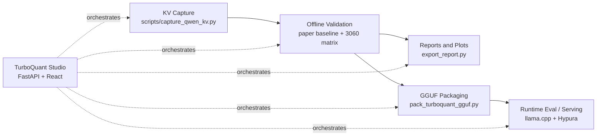

# TurboQuant CUDA

Paper-faithful TurboQuant research and integration workspace for Qwen3.5-9B KV-cache compression.

This repository is the Windows-native workbench for:

- reproducing TurboQuant Stage 1 and Stage 2 offline
- validating captured Qwen3.5-9B KV behavior with hidden, attention, and logit metrics
- extending the K path with triality-proxy SO(8) and multiscreen relevance
- packaging GGUF artifacts for `llama.cpp` and Hypura
- running a local FastAPI + React Studio UI on top of the existing CLI flows

## TL;DR

- **What this repo is:** a reproducible TurboQuant prototype for offline-first KV-cache research on Qwen3.5-9B
- **Current practical K-side reference:** `key_only_block_so8_triality_vector`
- **Mainline reference workflow:** RTX 3060 12 GB reduced 7-mode comparison matrix
- **Primary value:** it does not stop at reconstruction error; it keeps hidden-state, attention/logit, memory, and runtime surfaces separate
- **Platform target:** Windows + `uv` + Python 3.12.x first

## Why This Repo Exists

Most TurboQuant summaries focus on memory reduction and score-like behavior. This repo exists to answer the harder questions that matter in practice:

1. Does paper-faithful TurboQuant reproduce cleanly on captured Qwen3.5-9B KV?
2. What changes when we judge hidden-state transport, not only logits?
3. How far can we push the K path with learned SO(8) block rotations and triality-proxy views?
4. Can the offline artifact contract bridge cleanly into GGUF and current runtime loaders?

The design rule throughout the repo is:

**offline correctness first, runtime claims second**

## Current Mainline

- Qwen3.5-9B text-only captured KV on RTX 3060 12 GB
- fixed 7-mode reduced comparison matrix driven by `scripts\validate_qwen_3060_matrix.py`
- local `TurboQuant Studio` shell for setup, capture, validation, compare, packaging, and serve workflows
- GGUF packaging and runtime evaluation paths for `llama.cpp` and Hypura integration

### Mainline Modes

- `exact`
- `key_only_random`
- `full_kv`
- `asym_q8_turbo4`
- `asym_q8_turbo3`
- `multiscreen_relevance`
- `key_only_block_so8_triality_vector`

## Workflow Overview



## What Is In Scope

| Layer | Purpose |
| --- | --- |
| `turboquant.paper_baseline` | Paper-faithful Stage 1 and Stage 2 math, synthetic and captured attention replay |
| `turboquant.research_extension` | Multiscreen relevance, value-codec experiments, learned SO(8), triality-proxy K modes |
| `turboquant.adapters.hf_qwen` | Optional Hugging Face / Qwen capture and online diagnostic evaluation |
| `turboquant.runtime_eval` | Runtime benchmark and audit helpers for `llama.cpp`-style flows |
| `turboquant.studio_api` | Local FastAPI orchestration layer for TurboQuant Studio |

### Scope Labels

- **Paper-faithful:** TurboQuant Stage 1 + Stage 2, paper mixed-bit settings, synthetic and captured replay
- **Production canonical:** `key_only_block_so8_triality_vector`
- **Research / ablation:** random/static SO(8), learned block-SO(8), multiscreen variants, value-codec experiments, future true `triality_spin8`

## Triality-Proxy SO(8) In One Paragraph

The main differentiator in this repo is the K-side learned SO(8) block rotation path.

- the key head dimension is split into 8-dimensional blocks
- each block is fit with a learned SO(8) rotation
- those learned rotations are exposed through triality-proxy views
- the current practical default is the **vector proxy view**
- the runtime mode name is `key_only_block_so8_triality_vector`

This is not presented as true Spin(8) triality. It is explicitly a **triality-proxy** production path.

## Quick Start

Run everything from the repository root, the directory containing `pyproject.toml`.

```powershell
irm https://astral.sh/uv/install.ps1 | iex
uv python install 3.12.9
uv venv --python 3.12.9
uv sync --extra cu128 --extra dev --extra hf_qwen --extra eval
uv run python scripts\env_check.py
uv run python scripts\validate_repo_contract.py
```

### Extras

- `--extra cu128`: CUDA PyTorch
- `--extra dev`: pytest and local verification helpers
- `--extra hf_qwen`: Hugging Face / Qwen capture path
- `--extra eval`: runtime eval, HF online eval, and report export dependencies

## Start Here

### 1. Verify The Environment

```powershell
uv run python scripts\env_check.py
uv run python scripts\validate_repo_contract.py
```

### 2. Run The 12 GB Mainline Matrix

```powershell
uv run python scripts\capture_qwen_kv.py `
  --model-preset qwen35_9b_12gb `
  --weight-load 4bit `
  --dtype bfloat16 `
  --trust-remote-code `
  --model-id "H:\Qwen3.5-9B-official-hf" `
  --output-dir artifacts\kv_rtx3060_qwen9b `
  --max-length 64

uv run python scripts\validate_qwen_3060_matrix.py `
  --kv-dir artifacts\kv_rtx3060_qwen9b `
  --rotation-dir artifacts\research_extension\triality_full_train_prod_bf16\rotations `
  --eval-device cuda `
  --bits 3,3.5,4 `
  --trials 3 `
  --max-layers 2 `
  --output-dir artifacts\qwen_3060_matrix

uv run python scripts\export_report.py --matrix-dir artifacts\qwen_3060_matrix
```

### 3. Launch TurboQuant Studio

Backend:

```powershell
uv run python scripts\run_turboquant_studio.py
```

Frontend dev server:

```powershell
Set-Location .\studio-web
npm install
npm run dev
```

Production frontend build:

```powershell
Set-Location .\studio-web
npm run build
```

Then open:

- `http://127.0.0.1:8000/studio`

Studio is intentionally an operator shell, not a chat UI. It keeps `Validate -> Preview -> Run` visible for every workflow.

### 4. Package A GGUF Artifact

```powershell
uv run python scripts\pack_turboquant_gguf.py `
  --input-gguf path\to\base.gguf `
  --output-gguf path\to\output.turboquant.gguf `
  --profiles paper,so8_triality_vector `
  --default-profile exact `
  --hypura-compatible-profile auto
```

### 5. Run Runtime Evaluation

```powershell
uv run python scripts\eval_runtime_qwen.py `
  --mode exact `
  --model-path path\to\model.gguf `
  --server-bin vendor\llama.cpp\build\bin\Release\llama-server.exe `
  --llama-bench-bin vendor\llama.cpp\build\bin\Release\llama-bench.exe `
  --output-dir artifacts\runtime_eval `
  --dry-run
```

## Current 12 GB Matrix Snapshot

Source files:

- `artifacts\qwen_3060_matrix\metrics\qwen_3060_matrix_mean_pm_sd.csv`
- `artifacts\qwen_3060_matrix\metrics\qwen_3060_matrix_summary.csv`
- `artifacts\qwen_3060_matrix\reports\qwen_3060_matrix_summary.md`

Tracked README figure copies:


### 4-bit Headline Snapshot

| Mode | Logit cosine | Hidden cosine | Memory ratio vs exact |
| --- | --- | --- | --- |
| `exact` | `1.000000 +/- 0.000000` | `1.000000 +/- 0.000000` | `1.000000 +/- 0.000000` |
| `key_only_random` | `0.997396 +/- 0.006379` | `1.002604 +/- 0.004034` | `0.628906 +/- 0.000000` |
| `full_kv` | `0.997396 +/- 0.006379` | `0.994792 +/- 0.003189` | `0.255859 +/- 0.000000` |
| `asym_q8_turbo4` | `1.001302 +/- 0.005881` | `0.994141 +/- 0.004784` | `0.378906 +/- 0.000000` |
| `asym_q8_turbo3` | `0.996745 +/- 0.002941` | `0.981771 +/- 0.004731` | `0.347656 +/- 0.000000` |
| `multiscreen_relevance` | `1.002604 +/- 0.006379` | `1.000000 +/- 0.000000` | `0.660156 +/- 0.000000` |
| `key_only_block_so8_triality_vector` | `1.000000 +/- 0.000000` | `0.999349 +/- 0.001595` | `0.628906 +/- 0.000000` |

## Validation Policy

This repo is intentionally strict about how results are reported.

- Stage 1 and Stage 2 stay conceptually distinct
- exact-score and estimated-score are not collapsed into a single label
- reconstruction metrics stay separate from attention/logit metrics
- hidden-state transport matters; logit quality alone is not treated as enough
- runtime claims are made only when the runtime path itself is measured

That means this repo is comfortable saying:

- **memory reduction is real**
- **score-like behavior can remain strong**

but it does **not** automatically claim:

- hidden-state neutrality everywhere
- runtime superiority from replay-only evidence
- universal portability across all model and runtime stacks

## Build Contract

This checkout is intended to stay aligned with two external anchors:

- [zapabob/Turboquant-CUDA](https://github.com/zapabob/Turboquant-CUDA) for PyTorch / offline quantization semantics
- vendored [zapabob/llama.cpp](https://github.com/zapabob/llama.cpp) at `vendor/llama.cpp` for GGUF / runtime consumption

Rules:

- `.gitmodules` must keep `vendor/llama.cpp` pinned to the zapabob fork
- Rust and Hypura builds must use the vendored runtime, or an explicitly compatible checkout
- the top-level `tq_*` GGUF metadata arrays are the canonical export contract for current loaders
- repo integrity is checked by `repo_contract.toml` and `scripts\validate_repo_contract.py`

Recommended validation:

```powershell
uv run python scripts\validate_repo_contract.py
.\scripts\run_production_tests.ps1
```

## Key Scripts

| Script | Purpose |
| --- | --- |
| `scripts\capture_qwen_kv.py` | Capture Qwen3.5-9B KV artifacts |
| `scripts\paper_validate_synthetic.py` | Synthetic paper-baseline validation |
| `scripts\paper_validate_captured_qwen.py` | Captured paper-baseline replay |
| `scripts\validate_qwen_3060_matrix.py` | Reduced real 12 GB comparison matrix |
| `scripts\export_report.py` | Export markdown, tables, and plots from offline matrix outputs |
| `scripts\eval_hf_online_qwen.py` | Hugging Face online diagnostic evaluation |
| `scripts\eval_runtime_qwen.py` | Runtime benchmark and audit entrypoint |
| `scripts\export_online_eval_report.py` | Aggregate replay, HF, and runtime outputs |
| `scripts\pack_turboquant_gguf.py` | Embed TurboQuant metadata into GGUF |
| `scripts\run_turboquant_studio.py` | Start the local FastAPI Studio backend |

## Additional Research Flows

If you are not starting from the 12 GB mainline, the main secondary flows are:

- triality train/eval:
  - `scripts\research_train_k_triality.py`
  - `scripts\research_validate_k_triality.py`
  - `scripts\run_triality_full_pipeline.py`
  - `scripts\plot_triality_advantage.py`
- multiscreen + mixed-bit evaluation:
  - `scripts\research_validate_multiscreen_kv.py`
  - `scripts\research_vram_multigroup_qwen.py`
- value-codec experiments:
  - `scripts\research_validate_v_codecs.py`
  - `scripts\research_value_sensitivity.py`

## Related Repositories

| Repository | Role |
| --- | --- |
| [zapabob/Turboquant-CUDA](https://github.com/zapabob/Turboquant-CUDA) | Upstream PyTorch / offline TurboQuant semantics |
| [zapabob/llama.cpp](https://github.com/zapabob/llama.cpp) | Runtime GGUF loader and serving path |
| [zapabob/Hypura](https://github.com/zapabob/Hypura) | Tiered inference / serving integration target |
| [zapabob/multiscreen-pytorch](https://github.com/zapabob/multiscreen-pytorch) | Multiscreen reference implementation used in the relevance path |

## Contributing GPU Results

Additional GPU runs are welcome, especially:

- RTX 3080 Ti / 3090 / 4090 / 5090
- RDNA4 HIP / ROCm paths
- Apple M-series MPS / Metal paths

The most useful artifacts are:

- PPL outputs
- hidden / attention / logit comparison tables
- decode throughput
- VRAM / KV footprint measurements

## License

Apache-2.0
