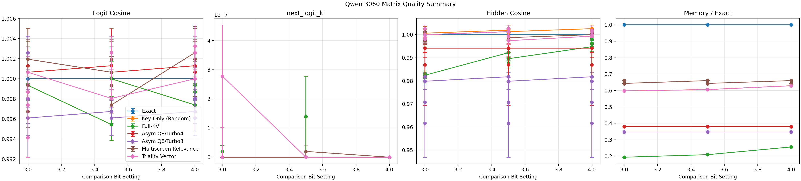
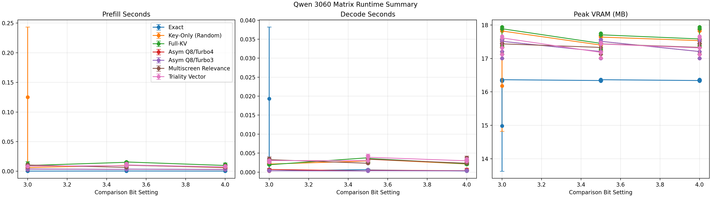
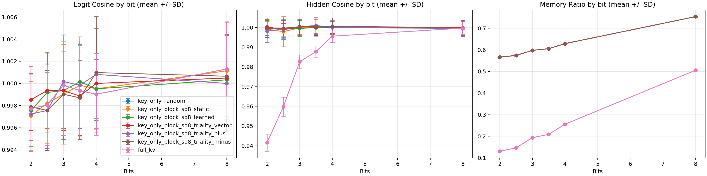
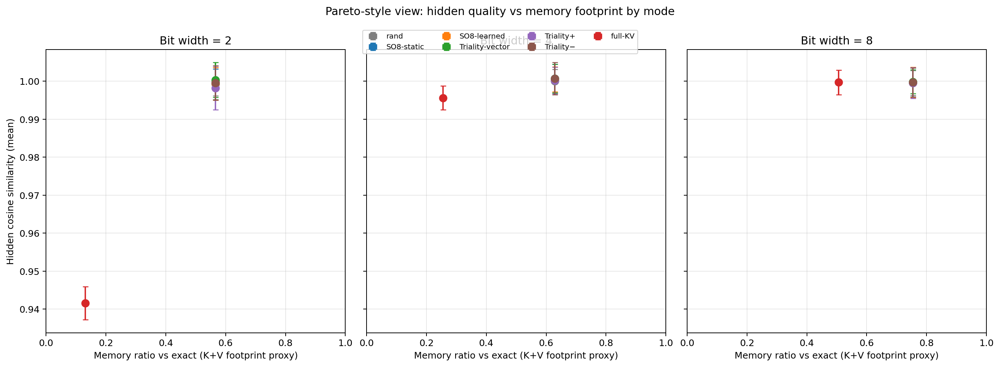
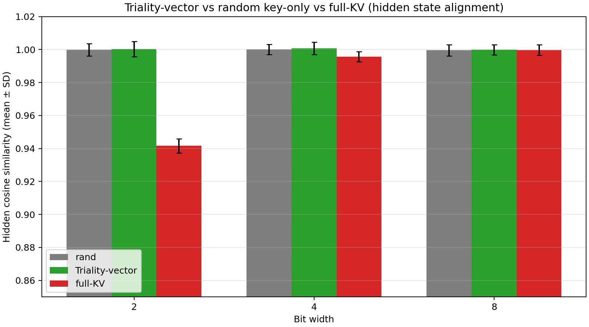
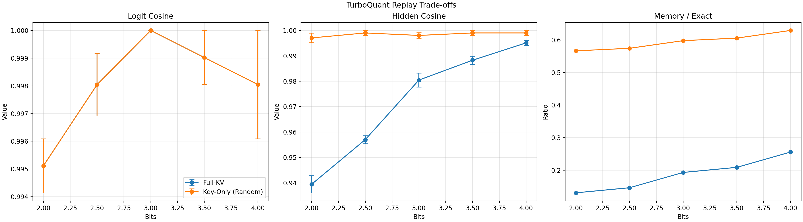
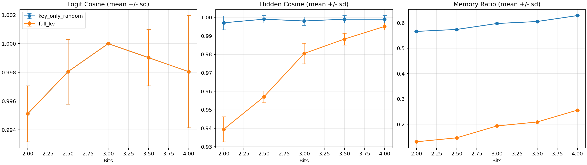

# TurboQuant CUDA

**TL;DR:** this is a Windows-first, offline-first TurboQuant research workspace that measures what usually gets hand-waved away: not just reconstruction, but hidden-state transport, attention behavior, GGUF packaging, and whether `TQ4_1S` / Triality artifacts actually survive the trip into a real `llama.cpp` runtime.

- **Best current K-side practical line:** `key_only_block_so8_triality_vector`
- **Best current story for readers:** reproducible RTX 3060 12 GB evidence, deterministic fixture export, and a vendored `zapabob/llama.cpp` that can now load real `TQ4_1S` GGUFs
- **What is already implemented here:** offline TurboQuant replay, Triality + learned SO(8) research/export, GGUF metadata/contract packaging, `TQ4_1S` converter/export, and CPU/CUDA-staged runtime loading in vendored `llama.cpp`
- **What is not claimed here:** a fused packed-weight CUDA kernel, a finished native `TQ4_1S -> q8_0 scratch` fast path, or universal runtime wins across every model/runtime stack
- **Why this repo exists:** to keep research-faithful math, artifact contracts, and runtime integration in one place instead of treating them as separate hand-wavy projects





## Why This Repo Is Worth Following

Most TurboQuant repos stop at one of these boundaries:

1. paper math without runtime integration
2. runtime integration without reproducible offline evidence
3. memory wins without hidden-state checks
4. codec contracts without deterministic export/import validation

This repo tries to keep the whole chain visible:

- **paper-faithful Stage 1 / Stage 2**
- **captured Qwen3.5-9B replay on real hardware**
- **Triality + learned SO(8) K-side experiments**
- **GGUF metadata and artifact packaging**
- **vendored `zapabob/llama.cpp` runtime consumption**
- **operator-facing local Studio flows on Windows**

That is also why the README keeps the evidence families in the top level instead of hiding them deep in artifact folders.

## What Shipped Recently

The latest implementation wave made the repo much closer to a full research-to-runtime handoff:

- **Byte-exact `TQ4_1S` export path**
  - Python GGUF export was aligned to the `llama.cpp` reference math and validated against real Gemma 4 artifacts.
- **Real `TQ4_1S` loadability in vendored `llama.cpp`**
  - `GGML_TYPE_TQ4_1S` is now loadable on CPU and through the current staged CUDA path in the vendored runtime.
- **Triality shared ABI hardening**
  - canonical naming, alias normalization, and stricter fail-closed metadata checks now reject incomplete artifacts instead of quietly accepting them.
- **Learned SO(8) export with explicit validity metrics**
  - orthogonality and determinant metrics are now carried through the Triality metadata line.

Implementation logs:

- [`_docs/2026-04-19_tq4_1s-python-e2e-byte-exact-and-real-gemma4-validation.md`](_docs/2026-04-19_tq4_1s-python-e2e-byte-exact-and-real-gemma4-validation.md)
- [`_docs/2026-04-19_llama_cpp_tq4_1s_ggml_loadable_path.md`](_docs/2026-04-19_llama_cpp_tq4_1s_ggml_loadable_path.md)
- [`_docs/2026-04-20_triality-shared-abi-and-fail-closed-runtime.md`](_docs/2026-04-20_triality-shared-abi-and-fail-closed-runtime.md)

## Current Mainline

The repo currently centers on:

- **Qwen3.5-9B text-only captured KV**
- **RTX 3060 12 GB reduced comparison matrices**
- **Triality fixture export for Qwen 3.5 and Gemma 4**
- **GGUF packaging for `llama.cpp` and Hypura-style consumers**
- **weight-side contract staging around `hypura.turboquant.weight.v1` and `codec=tq4_1s`**

Mainline K-side modes:

- `exact`
- `key_only_random`
- `full_kv`
- `asym_q8_turbo4`
- `asym_q8_turbo3`
- `multiscreen_relevance`
- `key_only_block_so8_triality_vector`

## 12 GB RTX 3060 Snapshot

For day-to-day reading, the practical 4-bit headline is:

| Mode | Logit cosine (M +/- SD) | Hidden cosine (M +/- SD) | Memory ratio vs exact (M +/- SD) |
| --- | --- | --- | --- |
| `exact` | `1.000000 +/- 0.000000` | `1.000000 +/- 0.000000` | `1.000000 +/- 0.000000` |
| `full_kv` | `0.997396 +/- 0.006379` | `0.994792 +/- 0.003189` | `0.255859 +/- 0.000000` |
| `asym_q8_turbo4` | `1.001302 +/- 0.005881` | `0.994141 +/- 0.004784` | `0.378906 +/- 0.000000` |
| `asym_q8_turbo3` | `0.996745 +/- 0.002941` | `0.981771 +/- 0.004731` | `0.347656 +/- 0.000000` |
| `multiscreen_relevance` | `1.002604 +/- 0.006379` | `1.000000 +/- 0.000000` | `0.660156 +/- 0.000000` |
| `key_only_block_so8_triality_vector` | `1.000000 +/- 0.000000` | `0.999349 +/- 0.001595` | `0.628906 +/- 0.000000` |

Practical reading:

- `key_only_block_so8_triality_vector` remains the **production K-side reference** because it keeps hidden-state quality high while staying simple to package and consume.
- `asym_q8_turbo4` is still the **aggressive memory-saving baseline** worth keeping in the README because it is the honest low-memory comparison point.
- `full_kv` still shows why this repo refuses to equate “good logit-like scores” with “safe hidden-state transport.”

## Implementation Summary

At this point, the repo has three clear layers.

| Layer | What is implemented now | What is deliberately still incomplete |
| --- | --- | --- |
| Offline research | paper-faithful Stage 1 / Stage 2, captured replay, Triality / SO(8), hidden and attention metrics | not every research branch is promoted to production defaults |
| Artifact contract | GGUF packaging, `hypura.turboquant.*`, `hypura.turboquant.weight.*`, deterministic fixture export, real Gemma 4 multimodal-safe guards | weight codec policy is ahead of fully optimized weight runtime kernels |
| Runtime path | vendored `zapabob/llama.cpp` can load real `TQ4_1S` GGUFs on CPU and the current staged CUDA line | no fused packed-weight CUDA kernel yet, and no claim that staged CUDA is the final performance architecture |

## Eval Output Layout

### Primary 12 GB Matrix Outputs

| Path | Contents |
| --- | --- |
| `artifacts/qwen_3060_matrix/metrics/qwen_3060_matrix_trials.csv` | Raw per-trial rows for the 7-mode 12 GB matrix |
| `artifacts/qwen_3060_matrix/metrics/qwen_3060_matrix_summary.csv` / `.md` | Pooled summary with mean, SD, SEM, and 95% CI |
| `artifacts/qwen_3060_matrix/metrics/qwen_3060_matrix_mean_pm_sd.csv` / `.md` | Mode x bit `M +/- SD` table |
| `artifacts/qwen_3060_matrix/metrics/qwen_3060_matrix_friedman.csv` / `.md` | Friedman test across the 7 modes |
| `artifacts/qwen_3060_matrix/metrics/qwen_3060_matrix_pairwise.csv` / `.md` | Pairwise Wilcoxon-Holm vs baseline modes |
| `artifacts/qwen_3060_matrix/reports/qwen_3060_matrix_summary.md` | Exported markdown summary used by repo docs |
| `artifacts/qwen_3060_matrix/plots/qwen_3060_matrix_attention.png` | Attention/logit trade-off plot with error bars |
| `artifacts/qwen_3060_matrix/plots/qwen_3060_matrix_runtime.png` | Runtime trade-off plot with error bars |

### Secondary Triality Outputs

| Path | Contents |
| --- | --- |
| `artifacts/research_extension/triality_full_eval_prod_bf16/metrics/triality_trials_captured.csv` | Raw per-trial rows |
| `artifacts/research_extension/triality_full_eval_prod_bf16/metrics/triality_summary_captured.csv` / `.md` | Pooled summary with mean, SD, SEM, and 95% CI |
| `artifacts/research_extension/triality_full_eval_prod_bf16/metrics/triality_summary_mean_pm_sd.csv` / `.md` | Mode x bit `M +/- SD` table |
| `artifacts/research_extension/triality_full_eval_prod_bf16/metrics/triality_statistics.csv` / `.md` | Mode-wise statistical tests |
| `artifacts/research_extension/triality_full_eval_prod_bf16/metrics/triality_friedman_rotation_modes.csv` / `.md` | Friedman test across K modes at fixed bit |
| `artifacts/research_extension/triality_full_eval_prod_bf16/metrics/triality_pairwise_wilcoxon_rotation_modes.csv` / `.md` | Pairwise Wilcoxon with Holm correction |
| `artifacts/research_extension/triality_full_eval_prod_bf16/plots/triality_*_captured.png` | Trade-off and `M +/- SD` plots |
| `artifacts/research_extension/triality_full_eval_prod_bf16/plots/triality_advantage_*.png` | Triality advantage figures |

## M +/- SD And Summary Statistics

### Triality rotation-family summary at 4 bits

Source: `artifacts/research_extension/triality_full_eval_prod_bf16/metrics/triality_summary_mean_pm_sd.csv`

| Mode | Logit cosine (M +/- SD) | Hidden cosine (M +/- SD) | Memory ratio (M +/- SD) |
| --- | --- | --- | --- |
| `key_only_block_so8_static` | `0.999512 +/- 0.003699` | `1.000651 +/- 0.003762` | `0.628906 +/- 0.000000` |
| `key_only_block_so8_learned` | `0.999512 +/- 0.002655` | `1.000488 +/- 0.003321` | `0.628906 +/- 0.000000` |
| `key_only_block_so8_triality_vector` | `1.000000 +/- 0.004461` | `1.000651 +/- 0.003762` | `0.628906 +/- 0.000000` |
| `key_only_block_so8_triality_plus` | `1.000814 +/- 0.004150` | `1.000163 +/- 0.003546` | `0.628906 +/- 0.000000` |
| `key_only_block_so8_triality_minus` | `1.000977 +/- 0.005054` | `1.000651 +/- 0.004258` | `0.628906 +/- 0.000000` |
| `full_kv` | `0.999023 +/- 0.003688` | `0.995605 +/- 0.003115` | `0.255859 +/- 0.000000` |

### Inferential summary

Source: `artifacts/research_extension/triality_full_eval_prod_bf16/metrics/triality_friedman_rotation_modes.md`

- For **hidden cosine**, the rotation-family differences are strongly non-random at low bits.
- At **4 bits**, the Friedman row is `statistic = 264.2103546677535`, `p = 3.7569452515144635e-54`, `n_blocks = 96`, `n_modes = 7`.
- This is exactly the kind of result the repo wants to expose: memory and logit-like scores alone do not tell the full story.

## Error-Bar Figures

### 12 GB matrix figures

These are the high-level figures most readers should look at first.


The tracked README copies come from the main 12 GB matrix export path. Plot points are means and the error bars come from the summary statistics emitted by the matrix export.

### Triality figures







## Pareto Frontiers

Keep these three evidence families together:

1. **Eval Output Layout**
   - raw trials, pooled summaries, pairwise tests, and plots
2. **Pareto Frontiers**
   - hidden/logit/memory trade-off views
3. **Paper Baseline Reference Results**
   - paper-faithful captured reference rows
4. **Triality Advantage Figures**
   - direct rotation-family comparisons

That is the minimum set that prevents “nice memory ratios” from turning into misleading conclusions.

## Paper Baseline Reference Results

Source: `artifacts/paper_baseline/qwen_captured_reported/metrics/attention_summary_captured_mean_pm_sd.md`

| Bits | Logit cosine | Hidden cosine (KO) | Hidden cosine (FV) | Memory/exact (KO) | Memory/exact (FV) | Attention relative error (KO) | Attention relative error (FV) |
| ---: | --- | --- | --- | ---: | ---: | --- | --- |
| 2 | `0.995117 +/- 0.001953` | `0.997070 +/- 0.003740` | `0.939453 +/- 0.006766` | `0.566406` | `0.130859` | `0.048950 +/- 0.025218` | `0.340332 +/- 0.003336` |
| 2.5 | `0.998047 +/- 0.002255` | `0.999023 +/- 0.001953` | `0.957031 +/- 0.003189` | `0.574219` | `0.146484` | `0.033066 +/- 0.013036` | `0.287109 +/- 0.001595` |
| 3 | `1.000000 +/- 0.000000` | `0.998047 +/- 0.002255` | `0.980469 +/- 0.005524` | `0.597656` | `0.193359` | `0.023590 +/- 0.007530` | `0.184570 +/- 0.000797` |
| 3.5 | `0.999023 +/- 0.001953` | `0.999023 +/- 0.001953` | `0.988281 +/- 0.003189` | `0.605469` | `0.208984` | `0.014328 +/- 0.004094` | `0.150635 +/- 0.002916` |
| 4 | `0.998047 +/- 0.003906` | `0.999023 +/- 0.001953` | `0.995117 +/- 0.001953` | `0.628906` | `0.255859` | `0.009918 +/- 0.003365` | `0.096924 +/- 0.001668` |

The baseline takeaway remains simple and important:

- K-only TurboQuant-like lines preserve hidden-state quality much better than `full_kv` at low bits.
- That is exactly why this repo treats K-side stability as the practical production question.





## Quick Start

Run everything from the repository root, the directory containing `pyproject.toml`.

```powershell
uv python install 3.12.9
uv venv --python 3.12.9
uv sync --extra cu128 --extra dev --extra hf_qwen --extra eval
uv run python scripts\env_check.py
uv run python scripts\validate_repo_contract.py
```

Main extras:

- `--extra cu128`: CUDA PyTorch
- `--extra dev`: pytest and verification helpers
- `--extra hf_qwen`: Hugging Face / Qwen capture path
- `--extra eval`: runtime eval and report export dependencies

## Start Here

### 1. Verify the environment

```powershell
uv run python scripts\env_check.py
uv run python scripts\validate_repo_contract.py
```

### 2. Launch the local Studio

Backend:

```powershell
uv run python scripts\run_turboquant_studio.py
```

Frontend dev server:

```powershell
Set-Location .\studio-web
npm install
npm run dev
```

### 3. Package a GGUF artifact

```powershell
uv run python scripts\pack_turboquant_gguf.py `
  --input-gguf path\to\base.gguf `
  --output-gguf path\to\output.turboquant.gguf `
  --profiles paper,so8_triality_vector `
  --default-profile exact `
  --hypura-compatible-profile auto
```

### 4. Export and verify Triality fixtures

```powershell
uv run python scripts\export_triality_fixture.py `
  --output-dir artifacts\triality_fixtures `
  --mode triality-proxy-so8-pareto `
  --model-family Qwen/Qwen3.5-27B

uv run python scripts\verify_triality_export.py `
  --manifest artifacts\triality_fixtures\triality-proxy-so8-pareto\triality-fixture-manifest.json
```

## Scope And Non-Claims

This repo is intentionally strict about what it claims.

It **does** claim:

- offline TurboQuant correctness matters
- hidden-state quality matters
- artifact contracts should be explicit and testable
- `TQ4_1S` should be validated end to end, not just named in metadata

It **does not** currently claim:

- a finished fused packed-weight CUDA kernel
- a final optimized `TQ4_1S -> q8_0 scratch + cuBLAS` implementation
- that every research branch should become a production default
- that replay-only evidence is the same as end-to-end runtime evidence

## Build Contract

- the vendored runtime is pinned through `.gitmodules` to `zapabob/llama.cpp`
- exported GGUF metadata is expected to preserve the current `tq_*` and `hypura.turboquant.*` contract surfaces
- repo integrity is checked by `repo_contract.toml` and `scripts\validate_repo_contract.py`
- runtime-facing README claims are limited to paths that were actually loaded or measured

## Related Repositories

| Repository | Role |
| --- | --- |
| [zapabob/Turboquant-CUDA](https://github.com/zapabob/Turboquant-CUDA) | Upstream PyTorch / offline TurboQuant semantics |
| [zapabob/llama.cpp](https://github.com/zapabob/llama.cpp) | Runtime GGUF loader and serving path |
| [zapabob/Hypura](https://github.com/zapabob/Hypura) | Tiered inference / serving integration target |
| [zapabob/multiscreen-pytorch](https://github.com/zapabob/multiscreen-pytorch) | Multiscreen reference implementation used in the relevance path |

## License

Apache-2.0
