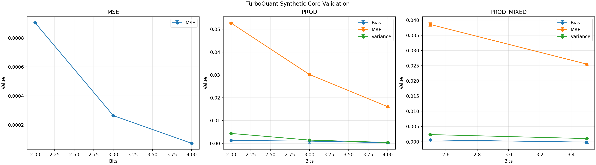
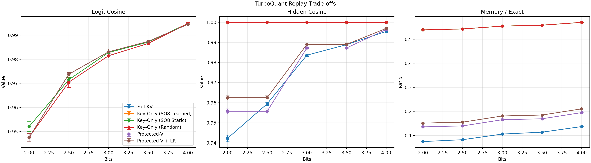
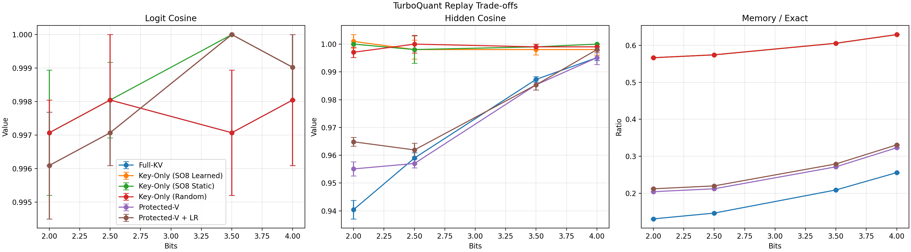

# Turboquant-CUDA

Measured TurboQuant KV-cache compression examples on Qwen3.5-9B for Windows +
CUDA, with paper-faithful offline replay and runtime-adjacent Pareto reports.

Research-grade TurboQuant prototype for KV-cache compression experiments on
Qwen3.5-9B in a Windows-native `uv` workflow.

The main comparison in this repository fixes the original `Qwen3.5-9B` weights
and changes only the KV-cache codec. The canonical decision gate is captured
replay on real KV tensors, not synthetic replay alone.

Licensed under the MIT License. See `LICENSE`.

## Focus

- Paper-faithful separation between `TurboQuantMSE` and `TurboQuantProd`
- Offline-first validation before runtime integration
- `key-only` as the current runtime default, with value quantization kept as a separate branch
- Research branch for `block-SO(8)` learned rotations on keys
- Research branch for sensitivity-protected value compression with optional low-rank residuals
- Reproducible CSV, Markdown, Matplotlib, and Plotly artifacts

## Quick Start

```powershell
uv python install 3.12.9
uv venv --python 3.12.9
uv sync --extra cu128 --extra dev
uv run python scripts\env_check.py
uv run python -m pytest -q
uv run python scripts\test_synthetic.py --trials 8
uv run python scripts\validate_attention_scores.py --query-source synthetic --trials 8 --synthetic-layers 8
uv run python scripts\export_report.py
```

## Main Entry Points

- `scripts\env_check.py`
- `scripts\test_synthetic.py`
- `scripts\capture_qwen_kv.py`
- `scripts\validate_attention_scores.py`
- `scripts\benchmark_encode_decode.py`
- `scripts\export_report.py`

## Qwen Smoke Examples

```powershell
uv run python scripts\capture_qwen_kv.py --weight-load 4bit --max-length 96
uv run python scripts\validate_attention_scores.py --query-source captured --kv-dir artifacts\kv --trials 1 --max-layers 1 --bits 2,2.5,3.5,4 --eval-device auto
uv run python scripts\validate_attention_scores.py --query-source synthetic --trials 8 --synthetic-layers 8 --eval-device auto
uv run python scripts\export_report.py
```

The default capture path uses the local official model export at
`H:\Qwen3.5-9B-official-hf` and a fixed 4-prompt text-only panel:

1. TurboQuant/KV explanation prompt
2. Short reasoning prompt
3. Minimal Python coding prompt
4. Summarization prompt

Each capture is stored under `artifacts/kv/<capture_id>/` with:

- `capture_manifest.json`
- `layer_{idx}_key.pt`
- `layer_{idx}_value.pt`

## Current Report

The current report is generated from the paper-faithful core in `turboquant/`
using SciPy summary statistics, Matplotlib error bars, and Plotly interactive
replay plots. The current mathematical bottleneck is the value path:
`full_kv` saves much more memory, but hidden-state drift is consistently larger
than the `key_only_block_so8_learned` path at the same key bit budget. The new
research branch adds `protected_v` and `protected_v_lowrank` as middle Pareto
points between exact values and aggressive full-KV compression.

Current captured recommendation: keep runtime default as `key-only`.
`protected_v` and `protected_v_lowrank` are promising intermediate Pareto
points, but they are not yet close enough to `key_only_block_so8_learned` on
real captured KV to replace it.





Interactive Plotly replay report: [artifacts/plots/attention_tradeoffs.html](artifacts/plots/attention_tradeoffs.html)

Runtime trade-off report: [artifacts/plots/attention_runtime_tradeoffs.html](artifacts/plots/attention_runtime_tradeoffs.html)



Interactive captured Plotly replay report: [artifacts/plots/attention_tradeoffs_captured.html](artifacts/plots/attention_tradeoffs_captured.html)

Captured runtime trade-off report: [artifacts/plots/attention_runtime_tradeoffs_captured.html](artifacts/plots/attention_runtime_tradeoffs_captured.html)

### Synthetic Replay Summary

Synthetic replay below uses 4 trials x 4 layers. Means are taken from
`artifacts/metrics/attention_summary_synthetic.csv`.

| Mode | Bits | Logit Cosine | Hidden Cosine | Memory / Exact |
| --- | ---: | ---: | ---: | ---: |
| key-only (SO8 learned) | 2.0 | 0.9476 | 1.0000 | 0.5391 |
| key-only (SO8 learned) | 2.5 | 0.9738 | 1.0000 | 0.5430 |
| key-only (SO8 learned) | 3.5 | 0.9874 | 1.0000 | 0.5586 |
| protected-V | 2.0 | 0.9476 | 0.9557 | 0.1355 |
| protected-V | 3.5 | 0.9874 | 0.9873 | 0.1691 |
| protected-V + low-rank | 2.0 | 0.9476 | 0.9625 | 0.1511 |
| protected-V + low-rank | 3.5 | 0.9874 | 0.9890 | 0.1847 |
| full-KV | 2.0 | 0.9477 | 0.9422 | 0.0742 |
| full-KV | 3.5 | 0.9866 | 0.9889 | 0.1133 |
| full-KV | 4.0 | 0.9948 | 0.9955 | 0.1367 |

The current synthetic Pareto picture is:

- `key_only_block_so8_learned` preserves hidden states almost perfectly, but still uses about `0.54-0.57x` exact KV memory.
- `full_kv` is the most memory-efficient branch, but hidden-state drift remains the dominant failure mode.
- `protected_v` and `protected_v_lowrank` are meaningful middle points: they cost more than full-KV but materially reduce hidden drift.
- On this synthetic replay, `protected_v_lowrank` is the strongest value-side branch so far, but it still does not match key-only hidden stability.

### Captured Replay Summary

Captured replay below uses the fixed 4-prompt panel and one real layer per
prompt from `artifacts/kv/`. Means are taken from
`artifacts/metrics/attention_summary_captured.csv`.

| Mode | Bits | Logit Cosine | Hidden Cosine | Memory / Exact |
| --- | ---: | ---: | ---: | ---: |
| key-only (SO8 learned) | 2.0 | 0.9971 | 1.0020 | 0.5664 |
| key-only (SO8 learned) | 2.5 | 0.9980 | 1.0010 | 0.5742 |
| key-only (SO8 learned) | 3.5 | 0.9990 | 0.9980 | 0.6055 |
| protected-V | 2.0 | 0.9971 | 0.9570 | 0.2044 |
| protected-V | 3.5 | 0.9990 | 0.9854 | 0.2715 |
| protected-V + low-rank | 2.0 | 0.9980 | 0.9609 | 0.2122 |
| protected-V + low-rank | 3.5 | 0.9990 | 0.9844 | 0.2793 |
| full-KV | 2.0 | 0.9971 | 0.9404 | 0.1309 |
| full-KV | 3.5 | 0.9990 | 0.9893 | 0.2090 |
| full-KV | 4.0 | 1.0000 | 0.9941 | 0.2559 |

### Captured Representative Runtime View

Captured replay on CUDA measures replay-side additional memory for saved layer
tensors. `peak_vram_mb` below is not the total VRAM footprint of full Qwen
generation.

| Mode | Bits | Memory / Exact | Hidden Cosine | Logit Cosine | Peak VRAM (MB) |
| --- | ---: | ---: | ---: | ---: | ---: |
| key-only (SO8 learned) | 2.0 | 0.5664 | 1.0010 | 0.9961 | 17.64 |
| protected-V + low-rank | 2.0 | 0.2122 | 0.9648 | 0.9961 | 21.06 |
| full-KV | 2.0 | 0.1309 | 0.9404 | 0.9971 | 17.70 |
| key-only (SO8 learned) | 4.0 | 0.6289 | 0.9980 | 0.9990 | 17.64 |
| protected-V + low-rank | 4.0 | 0.3308 | 0.9980 | 0.9990 | 21.06 |
| full-KV | 4.0 | 0.2559 | 0.9951 | 0.9980 | 17.70 |

The current captured conclusion is:

- Runtime default should stay `key-only`.
- `protected_v` and `protected_v_lowrank` create real middle Pareto points on real KV, but they do not yet approach `key_only_block_so8_learned` closely enough to replace it.
- The current captured recommendation is `protected-V is promising but not ready`.
- Secondary runtime tables now also track `prefill_seconds`, `decode_seconds`, and `peak_vram_mb`; `peak_vram_mb` is meaningful when replay runs with `--eval-device auto` on CUDA.

The default runtime should only move away from `key-only` if a value-aware
branch clearly beats `full_kv` on hidden-state metrics, gets close enough to
`key_only_block_so8_learned`, and justifies its additional implementation
complexity. Until then, `qwen35_rtx3060` stays on the current `key-only`
default.

### Core Summary Statistics

Means, standard deviations, SEM, and 95% confidence intervals come from
`artifacts/metrics/synthetic_metrics.csv`.

| Experiment | Bits | Metric | Mean | Std | SEM | 95% CI |
| --- | ---: | --- | ---: | ---: | ---: | --- |
| MSE | 2.0 | MSE | 0.000908 | 0.000004 | 0.000002 | [0.000902, 0.000914] |
| MSE | 3.0 | MSE | 0.000265 | 0.000002 | 0.000001 | [0.000262, 0.000268] |
| MSE | 4.0 | MSE | 0.000073 | 0.000001 | 0.000000 | [0.000072, 0.000074] |
| PROD | 2.0 | Bias | 0.000714 | 0.000881 | 0.000441 | [-0.000689, 0.002116] |
| PROD | 2.0 | MAE | 0.053406 | 0.001008 | 0.000504 | [0.051801, 0.055010] |
| PROD | 2.0 | Variance | 0.004478 | 0.000185 | 0.000093 | [0.004184, 0.004773] |
| PROD | 3.0 | Bias | 0.000450 | 0.001062 | 0.000531 | [-0.001240, 0.002139] |
| PROD | 3.0 | MAE | 0.029947 | 0.000342 | 0.000171 | [0.029404, 0.030491] |
| PROD | 3.0 | Variance | 0.001408 | 0.000037 | 0.000019 | [0.001348, 0.001467] |
| PROD | 4.0 | Bias | 0.000195 | 0.000558 | 0.000279 | [-0.000693, 0.001083] |
| PROD | 4.0 | MAE | 0.016197 | 0.000344 | 0.000172 | [0.015649, 0.016745] |
| PROD | 4.0 | Variance | 0.000416 | 0.000014 | 0.000007 | [0.000393, 0.000438] |
| PROD-MIXED | 2.5 | Bias | 0.000659 | 0.001240 | 0.000620 | [-0.001314, 0.002632] |
| PROD-MIXED | 2.5 | MAE | 0.038404 | 0.000584 | 0.000292 | [0.037474, 0.039334] |
| PROD-MIXED | 2.5 | Variance | 0.002323 | 0.000042 | 0.000021 | [0.002256, 0.002389] |
| PROD-MIXED | 3.5 | Bias | -0.000143 | 0.000437 | 0.000219 | [-0.000839, 0.000553] |
| PROD-MIXED | 3.5 | MAE | 0.025453 | 0.000453 | 0.000227 | [0.024731, 0.026174] |
| PROD-MIXED | 3.5 | Variance | 0.001021 | 0.000037 | 0.000018 | [0.000962, 0.001080] |

## Artifacts

- `artifacts/metrics/synthetic_metrics.csv`
- `artifacts/metrics/attention_summary_synthetic.csv`
- `artifacts/metrics/attention_summary_captured.csv`
- `artifacts/metrics/attention_thresholds_synthetic.csv`
- `artifacts/metrics/attention_thresholds_captured.csv`
- `artifacts/reports/summary.md`
- `artifacts/plots/synthetic_errorbars.png`
- `artifacts/plots/attention_tradeoffs.png`
- `artifacts/plots/attention_tradeoffs.html`
- `artifacts/plots/attention_runtime_tradeoffs.png`
- `artifacts/plots/attention_runtime_tradeoffs.html`
- `artifacts/plots/attention_tradeoffs_captured.png`
- `artifacts/plots/attention_tradeoffs_captured.html`
- `artifacts/plots/attention_runtime_tradeoffs_captured.png`
- `artifacts/plots/attention_runtime_tradeoffs_captured.html`
